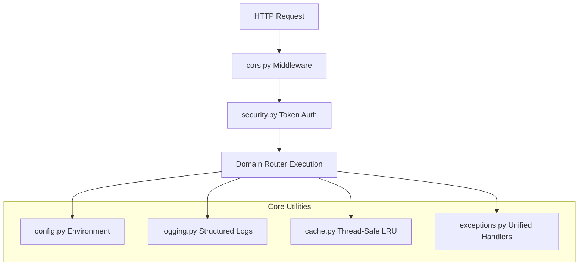

# Core Infrastructure (`backend/core/`)

## 1. Overview
The `app.core` package provides foundational cross-cutting capabilities for the Sonikoma backend platform. It encapsulates global environment configuration, JWT cryptographic token verification, security middleware, structured JSON/colored logging, thread-safe LRU caching mechanisms, and unified exception handling.

---

## 2. Component Breakdown
- **`config.py`**: Central Pydantic `BaseSettings` engine. Reads environment variables from `.env` files with sensible local development defaults (ports, database paths, secret keys, API versioning, third-party provider keys).
- **`security.py`**: Cryptographic password hashing (bcrypt / PBKDF2), JWT access and refresh token generation, RSA/HMAC signature verification, and claims decoding.
- **`logging.py`**: Standardized logging infrastructure with contextual metadata formatting (request IDs, execution latency, error stack traces).
- **`cache.py`**: Thread-safe in-memory LRU cache managers supporting key-based eviction, TTL invalidation, and cache telemetry.
- **`exceptions.py`**: Custom application domain exception hierarchies (e.g. `AuthException`, `ResourceNotFoundException`, `JobExecutionError`, `ProviderQuotaExceededError`).
- **`cors.py`**: Cross-Origin Resource Sharing middleware setup supporting local development ports (`http://localhost:5173`, `http://localhost:3000`) and production origins.

---

## 3. Configuration Variables Table

| Key | Type | Default | Description |
| :--- | :--- | :--- | :--- |
| `NODE_ENV` | `str` | `development` | Deployment mode (`development`, `staging`, `production`). |
| `BACKEND_PORT` | `int` | `8000` | Port for the Uvicorn ASGI HTTP listener. |
| `SECRET_KEY` | `str` | `sonikoma-insecure-secret-key` | HMAC secret for signing JWT auth tokens. |
| `DATABASE_URL` | `str` | `sqlite:///data/webtoon_local.db` | Connection string for SQLite or Postgres/Supabase. |
| `STORAGE_DIR` | `str` | `data/storage` | Root filesystem directory for projects, chapters, and media assets. |
| `GEMINI_API_KEY` | `str` | `None` | Google Gemini API key for multimodal vision and AI scripting. |

---

## 4. Mermaid Architecture Diagram

---

## 5. Security & Token Handling
- Tokens use standard `Bearer` authorization headers.
- Access tokens expire after 24 hours in local development; production configurations support short-lived access tokens (15m) paired with rotating refresh tokens.
- Sensitive environment secrets are masked from system telemetry and status endpoints.

---

## 6. Error Handling Strategy
Exceptions raised during request execution are caught by FastAPI global exception handlers:
- `HTTPException`: Preserves status code and outputs `{ "detail": "...", "status_code": ... }`.
- `ValidationException`: Formats Pydantic parameter validation failures into readable error lists.
- Unhandled `Exception`: Logs full traceback to disk, emitting sanitized 500 error responses to clients.

---

## 7. Performance & Optimization
- **Cached Settings**: Configuration is instantiated once at startup and cached in memory.
- **LRU Fast-Paths**: Cache hits in `cache.py` resolve in sub-microsecond intervals without locking the global interpreter lock unnecessarily.
