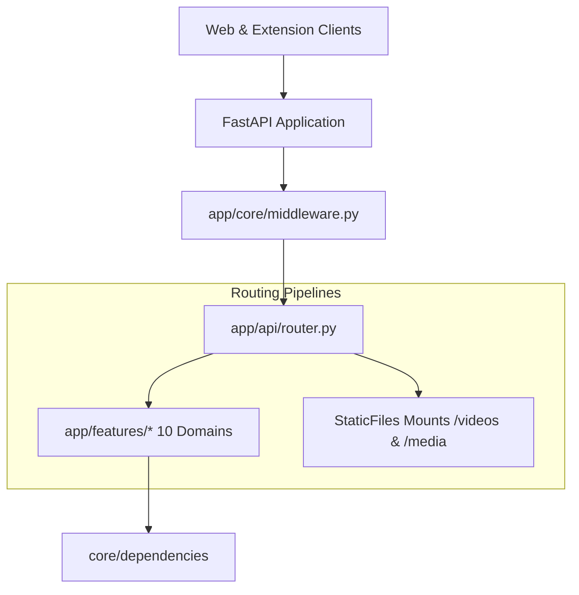

# Application Router Layer (`backend/app/router/`)

## 1. Overview
The `app.router` package serves as the master routing hub and static media mount manager for the Sonikoma backend, directly mirroring the frontend's `src/app/router/AppRouter.tsx`. It coordinates incoming client requests from the React web app and Chrome extension, mounts domain-driven feature routers from `app.features.*`, and serves static video and media assets.

---

## 2. Component Breakdown
- **`router.py`**: The master router registry. Aggregates all domain routers from `app.features.*` (`auth`, `platform`, `workspace`, `image_editor`, `video_editor`, `creative`, `intelligence`, `landing`, `profile`, `admin`) and mounts static media directories (`/media`, `/videos`).
- **`__init__.py`**: Public export interface exposing `api_router` and `register_routers`.
- **Note on Shared Dependencies & Middleware**:
  - Reusable dependency providers (e.g. `get_current_user`, `get_all_user_keys`) reside in [`app/shared/dependencies/`](file:///c:/Users/dheen/project/Sonikoma/backend/app/shared/dependencies/).
  - ASGI middleware pipeline (CORS, Rate Limiting, Request Tracing, Auth Guards) is centralized in [`app/core/middleware.py`](file:///c:/Users/dheen/project/Sonikoma/backend/app/core/middleware.py).

---

## 3. Router Hierarchy & Path Registry

| Mount Path | Primary Target | Description |
| :--- | :--- | :--- |
| `/api/v1/auth` | `app.features.auth` | User authentication, token issuance, password reset. |
| `/api/v1/platform` | `app.features.platform` | Platform shell, dashboard, projects, scraper, jobs, shortcuts, terminal, notifications. |
| `/api/v1/workspace` | `app.features.workspace` | Workspace shell, storyboard, reader viewer, imported assets. |
| `/api/v1/image-editor` | `app.features.image_editor` | Panel splitting, image transformations, speech bubble OCR. |
| `/api/v1/video-editor` | `app.features.video_editor` | Video timeline rendering, TTS voice synthesis, audio mixing. |
| `/api/v1/creative` | `app.features.creative` | YouTube direct publishing, export bundles. |
| `/api/v1/intelligence` | `app.features.intelligence` | Multimodal AI analysis, series memory, dramatization. |
| `/api/v1/landing` | `app.features.landing` | Public video showcase, platform stats, subscription tiers. |
| `/api/v1/profile` | `app.features.profile` | Creator profile details, avatars, API key vaults. |
| `/api/v1/admin` | `app.features.admin` | System settings, telemetry analytics, superuser tools. |
| `/media`, `/videos` | Static Directory Mounts | Direct streaming of rendered video files and extracted panels. |

---

## 4. Mermaid Architecture Diagram



---

## 5. Dependency Injection Pattern
Route handlers across `app.features` inject user state and credentials directly from `core.dependencies`:
```python
from fastapi import APIRouter, Depends
from core.dependencies import get_current_user, get_optional_current_user

router = APIRouter()

@router.get("/protected-resource")
async def get_resource(current_user: dict = Depends(get_current_user)):
    user_id = current_user["user_id"]
    ...
```

---

## 6. Performance & Optimization
- **Non-Blocking Handlers**: All I/O-intensive route handlers are declared `async def`, delegating heavy computation to background workers.
- **Direct Static Streaming**: Media files bypass Python memory copies via optimized ASGI StaticFiles and range headers for video seekability.
