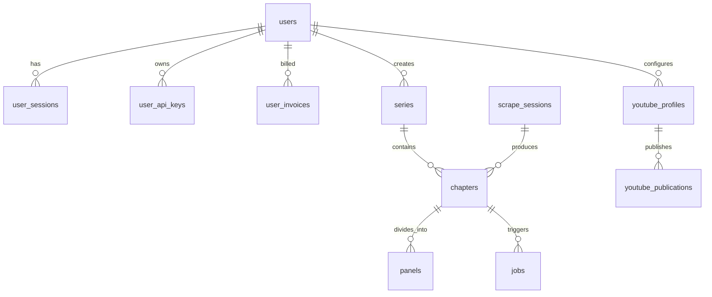

# Database Infrastructure (`backend/database/`)

## 1. Overview & Architecture
The `database/` package provides Sonikoma's unified database abstraction layer, operating on **SQLite (WAL Mode)** with thread-safe connection pooling, automated schema validation, and cloud bucket storage integration:

```text
backend/database/
├── __init__.py         # Package root with unified public exports
├── bootstrap.py        # Thread-safe database startup orchestration & mutex guards
├── config.py           # Path constants, environment variables, and credit thresholds
├── engine.py           # Low-level SQLite connection factory with WAL mode & PRAGMAs
├── migrator.py         # Canonical schema applicator, safe incremental column alters, and dead table pruning
├── schema.sql          # Canonical 30-table DDL schema with domain grouping and indexed date sorting
├── utils.py            # Unified utilities: UUID/datetime generation, slugs, transactions, proxy unwrapping
├── supabase.py         # Supabase client and storage bucket upload integration
└── README.md           # Database architecture documentation
```

---

## 2. Entity-Relationship & Domain Table Mapping

All application state is partitioned logically across Sonikoma's 8 canonical domain sections in `schema.sql`:



### Table Breakdown by 10 Core Application Domains:
| # | Feature Domain | Sub-Domain | Database Tables | Responsibilities |
| :---: | :--- | :--- | :--- | :--- |
| **1** | **`admin/`** | `settings`, `notifications`, `moderation` | `platform_settings`, `system_announcements`, `content_moderation_logs` | Global toggles, banner announcements, safety moderation |
| **2** | **`landing/`** | `showcase`, `pricing` | *(Stateless / public queries)* | Public landing page metrics (reads series/user aggregates) |
| **3** | **`auth/`** | `identity`, `session`, `security` | `users`, `user_sessions`, `user_audit_logs` | Credential auth, login sessions, security event audits |
| **4** | **`workspace/`** | `shell`, `storyboard` | `chapters`, `panels` | Storyboard scene breakdowns, voiceover scripts, panel queues |
| **5** | **`image-editor/`** | `canvas`, `auto-crop`, `history` | `panels`, `edit_history` | Panel detection, crop coordinates, bubble params, edit cache history |
| **6** | **`video-editor/`** | `timeline`, `render` | `chapters`, `panels` | Video render status, frame timings, motion transitions, audio sync |
| **7** | **`creative/`** | `youtube`, `agent` | `user_youtube_channels`, `youtube_oauth_tokens`, `youtube_profiles`, `youtube_publications`, `youtube_credentials`, `creator_style_profiles` | YouTube publishing, OAuth2 credentials, creator style preferences |
| **8** | **`platform/`** | `projects`, `scraper`, `jobs`, `terminal` | `series`, `chapters`, `scrape_sessions`, `series_chapters_cache`, `jobs`, `system_logs` | Series/chapter lifecycle, web scraping, async jobs, debug logs |
| **9** | **`profile/`** | `account`, `api-keys`, `billing` | `users`, `user_api_keys`, `user_invoices`, `credit_transactions` | Creator bio, developer API keys, billing invoices, credit wallet |
| **10** | **`intelligence/`** | `series-studio`, `lore`, `routing` | `ai_series_projects`, `series_continuity_memory`, `series_feedback_events`, `ai_token_usage_ledger`, `token_usage_logs` | AI project state, lore memory, RLHF feedback, token usage ledger |

---

## 3. Connection Lifecycle & Utilities

### Connection Factory (`engine.py`)
Repositories and services obtain managed connections via `get_db_connection`:
```python
from database.engine import get_db_connection

conn = get_db_connection()
try:
    cursor = conn.cursor()
    cursor.execute("SELECT * FROM chapters WHERE user_id = ?", (user_id,))
    rows = cursor.fetchall()
finally:
    conn.close()
```

### Managed Transactions (`utils.py`)
Atomic operations wrapped with `managed_transaction` guarantee automatic commit on success and rollback on exceptions:
```python
from database import managed_transaction

with managed_transaction(conn) as active_conn:
    active_conn.execute("INSERT INTO series (id, title) VALUES (?, ?)", (series_id, title))
    active_conn.execute("INSERT INTO chapters (id, series_id) VALUES (?, ?)", (chapter_id, series_id))
    # Automatically committed at block exit, or rolled back on error
```

---

## 4. Migrations & Schema Evolution (`migrator.py`)
- **Canonical Schema**: `schema.sql` defines the desired state for all 30 tables, foreign key constraints, and performance indexes using `CREATE TABLE IF NOT EXISTS` and `CREATE INDEX IF NOT EXISTS`.
- **Migration Runner**: On app startup in `bootstrap.init_db()`, `migrator.init_sqlite()` verifies the canonical schema, runs safe non-destructive column additions for older SQLite databases, drops obsolete dead tables, and backfills missing slugs.
