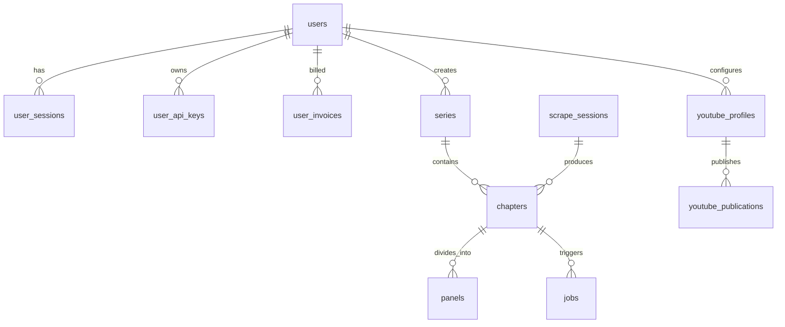

# Database Infrastructure (`backend/database/`)

## 1. Overview & Architecture
The `database/` package provides Sonikoma's unified database abstraction layer, supporting **dual-engine execution**:
- **SQLite**: Local development and embedded tests (`app.db` or `sonikoma.db`).
- **PostgreSQL / Supabase**: Production deployments with connection pooling, pgvector, and automated backups when `DATABASE_URL` is set.

```text
backend/database/
├── __init__.py                # Consolidated package exports
├── bootstrap.py               # Initial schema initialization and startup guards
├── config.py                  # Database path, timeout, and connection configuration
├── engine.py                  # Core connection factory and engine pooling (get_db_connection)
├── health.py                  # DB connection health and default user assertion
├── migrator.py                # Versioned incremental migration runner
├── schema.sql                 # Unified canonical DDL schema (SQLite & PostgreSQL)
├── session.py                 # UUID generation and timestamp helpers
├── supabase.py                # Supabase client and storage bucket upload integration
├── transaction.py             # managed_transaction context manager & slug utilities
└── README.md                  # Primary database architecture documentation
```

---

## 2. Entity-Relationship & Domain Table Mapping

All application state is partitioned logically across Sonikoma's feature domains:



### Table Breakdown by Domain:
| Feature Domain | Tables | Responsibilities |
| :--- | :--- | :--- |
| **`auth` & `profile`** | `users`, `user_sessions`, `user_audit_logs`, `user_api_keys`, `user_invoices`, `credit_transactions` | Creator identities, sessions, security audit events, developer API credentials, billing ledger |
| **`platform/projects`** | `series`, `chapters`, `panels` | Top-level comics/manga, episode workspaces, panel crops, dialogue, and styling |
| **`platform/scraper`** | `scrape_sessions`, `series_chapters_cache`, `scraper_rules`, `scraper_l1_cache`, `scraper_l5_cache` | Scraped image URLs, site rate-limit rules, discovery caches |
| **`platform/jobs`** | `jobs` | Async background tasks, progress percentages, execution status |
| **`platform/terminal`**| `system_logs`, `token_usage_logs` | Server logging stream, runtime debug traces, LLM cost accounting |
| **`admin`** | `platform_settings`, `system_announcements`, `content_moderation_logs` | Global app toggles, banner announcements, safety moderation |
| **`creative`** | `user_youtube_channels`, `youtube_oauth_tokens`, `youtube_profiles`, `youtube_publications`, `youtube_credentials` | YouTube channel profiles, OAuth2 credentials, published upload history |
| **`intelligence`** | `ai_series_projects`, `series_continuity_memory`, `series_feedback_events`, `ai_token_usage_ledger` | AI project states, continuity lore memory, RLHF feedback, and model performance analytics |

---

## 3. Connection Lifecycle & Transaction Management

### Connection Factory (`engine.py`)
Repositories and services obtain managed connections via `get_db_connection`:
```python
from database.engine import get_db_connection

conn = get_db_connection()
try:
    cursor = conn.cursor()
    cursor.execute("SELECT * FROM chapters WHERE user_id = ?", (user_id,))
    rows = cursor.fetchall()
finally:
    conn.close()
```

### Managed Transactions (`transaction.py`)
Atomic operations wrapped with `managed_transaction` guarantee automatic commit on success and rollback on exceptions:
```python
from app.database import managed_transaction

with managed_transaction(conn) as cursor:
    cursor.execute("INSERT INTO series (id, title) VALUES (?, ?)", (series_id, title))
    cursor.execute("INSERT INTO chapters (id, series_id) VALUES (?, ?)", (chapter_id, series_id))
    # Automatically committed at block exit, or rolled back on error
```

---

## 4. Migrations & Schema Evolution (`migrator.py`)
- **Canonical Schema**: `schema.sql` defines the desired state for all tables, indexes, and views across both SQLite and PostgreSQL.
- **Migration Runner**: On app startup in `lifespan.py`, `migrator.init_sqlite()` / `migrator.init_postgres()` checks the database and executes incremental upgrade blocks idempotently.
