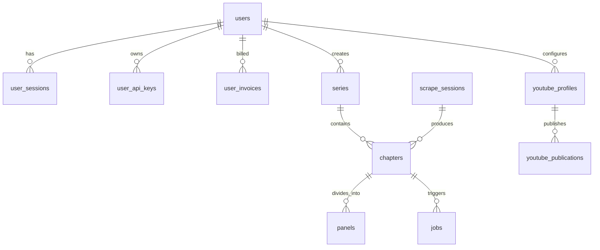

# Database Infrastructure (`backend/database/`)

## 1. Overview & Architecture
The `database/` package provides Sonikoma's unified database abstraction layer, operating on **SQLite (WAL Mode)** with thread-safe connection pooling, automated schema validation, and cloud bucket storage integration:

```text
backend/database/
├── __init__.py         # Package root with unified public exports
├── bootstrap.py        # Thread-safe database startup orchestration & mutex guards
├── config.py           # Path constants, environment variables, and credit thresholds
├── engine.py           # Low-level SQLite connection factory with WAL mode & PRAGMAs
├── migrator.py         # Canonical schema applicator, safe incremental column alters, and dead table pruning
├── schema.sql          # Canonical 30-table DDL schema with domain grouping and indexed date sorting
├── utils.py            # Unified utilities: UUID/datetime generation, slugs, transactions, proxy unwrapping
├── supabase.py         # Supabase client and storage bucket upload integration
└── README.md           # Database architecture documentation
```

---

## 2. Entity-Relationship & Domain Table Mapping

All application state is partitioned logically across Sonikoma's 8 canonical domain sections in `schema.sql`:



### Table Breakdown by Domain:
| Feature Domain | Tables | Responsibilities |
| :--- | :--- | :--- |
| **`auth` & `profile`** | `users`, `user_sessions`, `user_audit_logs`, `user_api_keys`, `user_invoices`, `credit_transactions` | Creator identities, sessions, security audit events, developer API credentials, billing ledger |
| **`platform/projects`** | `series`, `chapters`, `panels` | Top-level comics/manga, episode workspaces, panel crops, dialogue, and styling |
| **`platform/scraper`** | `scrape_sessions`, `series_chapters_cache`, `scraper_rules`, `scraper_l1_cache`, `scraper_l5_cache` | Scraped image URLs, site rate-limit rules, discovery caches |
| **`platform/jobs`** | `jobs` | Async background tasks, progress percentages, execution status |
| **`platform/terminal`**| `system_logs`, `token_usage_logs` | Server logging stream, runtime debug traces, LLM cost accounting |
| **`admin`** | `platform_settings`, `system_announcements`, `content_moderation_logs` | Global app toggles, banner announcements, safety moderation |
| **`creative`** | `user_youtube_channels`, `youtube_oauth_tokens`, `youtube_profiles`, `youtube_publications`, `youtube_credentials` | YouTube channel profiles, OAuth2 credentials, published upload history |
| **`intelligence`** | `ai_series_projects`, `series_continuity_memory`, `series_feedback_events`, `ai_token_usage_ledger` | AI project states, continuity lore memory, RLHF feedback, and model performance analytics |

---

## 3. Connection Lifecycle & Utilities

### Connection Factory (`engine.py`)
Repositories and services obtain managed connections via `get_db_connection`:
```python
from database.engine import get_db_connection

conn = get_db_connection()
try:
    cursor = conn.cursor()
    cursor.execute("SELECT * FROM chapters WHERE user_id = ?", (user_id,))
    rows = cursor.fetchall()
finally:
    conn.close()
```

### Managed Transactions (`utils.py`)
Atomic operations wrapped with `managed_transaction` guarantee automatic commit on success and rollback on exceptions:
```python
from database import managed_transaction

with managed_transaction(conn) as active_conn:
    active_conn.execute("INSERT INTO series (id, title) VALUES (?, ?)", (series_id, title))
    active_conn.execute("INSERT INTO chapters (id, series_id) VALUES (?, ?)", (chapter_id, series_id))
    # Automatically committed at block exit, or rolled back on error
```

---

## 4. Migrations & Schema Evolution (`migrator.py`)
- **Canonical Schema**: `schema.sql` defines the desired state for all 30 tables, foreign key constraints, and performance indexes using `CREATE TABLE IF NOT EXISTS` and `CREATE INDEX IF NOT EXISTS`.
- **Migration Runner**: On app startup in `bootstrap.init_db()`, `migrator.init_sqlite()` verifies the canonical schema, runs safe non-destructive column additions for older SQLite databases, drops obsolete dead tables, and backfills missing slugs.
