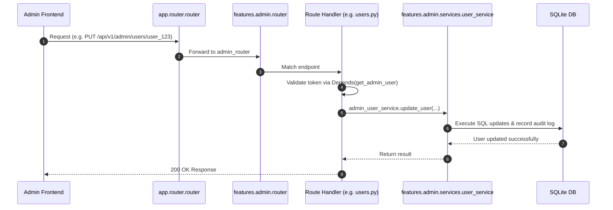

# Superuser Admin & Management Domain (`backend/features/admin/`)

## 1. Overview & Architecture
The `admin` feature domain empowers platform superusers to inspect real-time system performance, manage creators, view global audit logs, configure system announcements, oversee background jobs, audit financial ledgers, and manage domain scraping rules.

Following the project's standard clean architecture (consistent with `profile/` and other core feature modules), the admin feature domain avoids fragmenting into multiple sub-domains and instead adheres to the standard pattern:
- **`router/`**: Modular route controllers (`users.py`, `settings.py`, `finance.py`, `audit.py`, `projects.py`, `jobs.py`, `database.py`, `telemetry.py`, `__init__.py`).
- **`schemas.py`**: Unified Pydantic schemas (data contracts for request validation and response formatting).
- **`service.py`**: `AdminService` unified facade delegating to specialized services.
- **`services/`**: Focused domain services (`user_service.py`, `settings_service.py`, `audit_service.py`, `project_service.py`, `finance_service.py`, `database_service.py`, `job_service.py`, `telemetry_service.py`, `__init__.py`).
- **`README.md`**: Architectural documentation and specifications.

---

## 2. Directory Structure & Organization

```
backend/features/admin/
├── __init__.py                # Module initialization: exports router, admin_service, AdminService, services, schemas
├── schemas.py                 # Pydantic schemas (AdminUpdateUser, AdminUpdateSettings, etc.)
├── service.py                 # AdminService facade & admin_service singleton
├── README.md                  # Unified architectural documentation
├── router/                    # Route controllers aggregated into admin_router
│   ├── __init__.py            # Aggregates and mounts all sub-routers with OpenAPI tags
│   ├── audit.py               # Audit logs, CSV stream, moderation logs
│   ├── database.py            # Whitelisted database table inspector
│   ├── finance.py             # Credit ledger, user invoices, revenue metrics
│   ├── jobs.py                # Background job control, cancellation, purge
│   ├── projects.py            # System-wide project/series moderation
│   ├── settings.py            # Global settings, reset defaults, cache purge, announcements
│   ├── telemetry.py           # Analytics, LLM token metrics, scraper rules
│   └── users.py               # User listing, role updates, account locking, impersonation
└── services/                  # Specialized business logic services
    ├── __init__.py            # Exports all specialized services & singletons
    ├── audit_service.py       # Audit logs, activity CSV export, moderation inspection
    ├── database_service.py    # Raw table inspection logic
    ├── finance_service.py     # Credit transaction queries and billing calculations
    ├── job_service.py         # Job manager control & lifecycle operations
    ├── project_service.py     # Project series moderation and deletion
    ├── settings_service.py    # Platform configuration and announcements management
    ├── telemetry_service.py   # Global metrics, token consumption, scraping rules
    └── user_service.py        # User management, bulk actions, impersonation tokens
```

---

## 3. Route & Service Responsibilities

| Module | Route File | Service File | Endpoints & Key Capabilities |
| :--- | :--- | :--- | :--- |
| **Users** | `router/users.py` | `services/user_service.py` | `GET/PUT/DELETE /admin/users`, `POST /admin/users/{id}/add-credits`, `GET /admin/users/{id}/logs`, `POST /admin/users/bulk`, `POST /admin/impersonate/{user_id}` |
| **Settings** | `router/settings.py` | `services/settings_service.py` | `GET/PUT /admin/settings`, `POST /admin/settings/reset`, `POST /admin/settings/purge-cache`, `GET/POST/DELETE /admin/announcements` |
| **Finance** | `router/finance.py` | `services/finance_service.py` | `GET /admin/credits/transactions` (dynamic ledger), `GET /admin/finance/invoices` (billing & revenue) |
| **Audit** | `router/audit.py` | `services/audit_service.py` | `GET /admin/audit-logs`, `GET /admin/activity/export` (CSV stream), `GET /admin/moderation/logs` |
| **Projects** | `router/projects.py` | `services/project_service.py` | `GET/PUT/DELETE /admin/projects` (content moderation, flags, status) |
| **Jobs** | `router/jobs.py` | `services/job_service.py` | `GET /admin/jobs`, `POST /admin/jobs/{id}/cancel`, `DELETE /admin/jobs/{id}`, `POST /admin/jobs/purge-completed`, `POST /admin/jobs/cancel-all-active` |
| **Database** | `router/database.py` | `services/database_service.py` | `GET /admin/db/query` (table pagination & inspection) |
| **Telemetry** | `router/telemetry.py` | `services/telemetry_service.py` | `GET /admin/analytics`, `GET /admin/usage/tokens`, `GET/POST/DELETE /admin/scrapers/rules` |

---

## 4. Execution Data Flow (Mermaid Diagram)



---

## 5. Security & RBAC Enforcement
- Every route is protected by `Depends(get_admin_user)`.
- Non-admin attempts return `403 Forbidden` with a security audit event emitted to `user_audit_logs`.
- Superuser impersonation generates signed JWT bearer tokens with `"is_impersonation": True` and audits the issuing administrator's identity and IP address.
