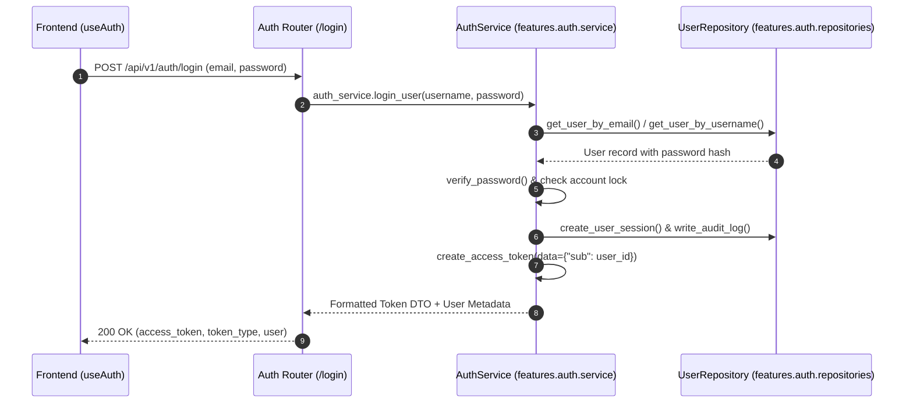

# Authentication & Security Module (`backend/features/auth/`)

## 1. Overview & Architecture
The `auth` feature domain encapsulates Sonikoma's authentication lifecycle, token issuance, session handling, password management, and OAuth integrations.

Following the project's standard clean architecture (consistent with `landing/` and `admin/`), the domain centers around three primary pillars:
- `schemas.py`: Canonical Pydantic schemas for authentication, token payload, profile parameters, developer API keys, and billing.
- `service.py`: `AuthService` (and singleton `auth_service`) orchestrating token validation, credential verification, registration, password hashing, and OAuth flows.
- `router.py`: Master FastAPI router coordinating the sub-routers (`login`, `register`, `password`, `oauth`).

---

## 2. Directory Structure & Layout

```
backend/features/auth/
├── __init__.py                # Exports auth_router, router, AuthService, auth_service, schemas
├── router.py                  # Master router aggregating login, register, password, oauth
├── schemas.py                 # Canonical Pydantic schemas (UserRegister, UserLogin, Token, etc.)
├── schemas_auth.py            # Backward-compatibility shim
├── service.py                 # AuthService & auth_service singleton (business logic)
├── services_auth/             # Backward-compatibility shim directory
│   ├── __init__.py
│   └── auth_service.py
├── login.py                   # /token, /login endpoints (delegates to auth_service)
├── register.py                # /register endpoint (delegates to auth_service)
├── password.py                # /forgot-password, /password endpoints (delegates to auth_service)
├── oauth.py                   # /google/login, /callback, /session endpoints (delegates to auth_service)
└── repositories/              # Database persistence layer for users and user_sessions
```

---

## 3. Endpoints & API Contract Reference

| Method | Endpoint | Summary | Auth Required | Request Model | Response Model | Status Codes |
| :--- | :--- | :--- | :--- | :--- | :--- | :--- |
| `POST` | `/api/v1/auth/token` | Obtain bearer token (OAuth2 form or JSON) | No | `OAuth2PasswordRequestForm` / JSON | `Token` | 200, 400, 401 |
| `GET` | `/api/v1/auth/token` | Verify active bearer token | Bearer JWT | None | User profile | 200, 401 |
| `POST` | `/api/v1/auth/login` | User login with email/password | No | `UserLogin` | `Token` | 200, 401, 403 |
| `POST` | `/api/v1/auth/register` | Register new user account | No | `UserRegister` | `Token` | 201, 400, 500 |
| `POST` | `/api/v1/auth/forgot-password` | Request password reset token | No | `ForgotPasswordRequest` | Standard message | 200 |
| `PUT` | `/api/v1/auth/password` | Update account password | Bearer JWT | `PasswordUpdate` | Standard message | 200, 400 |
| `GET` | `/api/v1/auth/google/login` | Initiate Google OAuth2 flow | No | None | Redirect (302) | 302 |
| `GET` | `/api/v1/auth/google/callback` | OAuth2 callback handler | No | Query `code`, `state` | Cookie + Redirect | 302 |
| `GET` | `/api/v1/auth/google/session` | Validate OAuth cookie session | Cookie | None | `Token` JSON | 200, 401 |

---

## 4. Execution Data Flow (Mermaid Diagram)



---

## 5. Security & RBAC Enforcement
- Passwords hashed using bcrypt / Argon2.
- Bearer JWT tokens signed with `HS256` using `SECRET_KEY`.
- Developer live API keys prefixed with `av_live_` resolved directly to user records.
- Audit logs emitted on every login attempt, password change, and registration.
