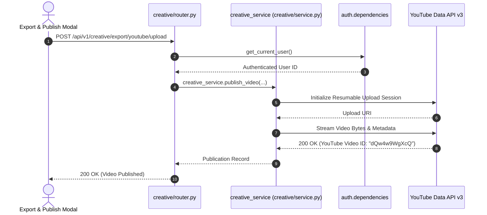

# Creative Feature Module (`backend/features/creative/`)

## 1. Overview & Architecture
The **Creative** feature domain governs the final publication, syndication, and distribution stages of animated video projects in Sonikoma. It mirrors the frontend `src/features/creative/` suite, empowering creators to export render packages, download ZIP bundles, manage YouTube OAuth2 API credentials, configure target channels, and publish animated comic episodes directly to YouTube with automated descriptions, tags, and thumbnails.

Following the project's standard clean architecture (`service → schemas → router → README`):
- **Root Facade**:
  - [`router.py`](file:///c:/Users/dheen/project/Sonikoma/backend/features/creative/router.py): Master domain router (`creative_router`) mounting `/export`.
  - [`schemas.py`](file:///c:/Users/dheen/project/Sonikoma/backend/features/creative/schemas.py): Canonical schemas for video export, profiles, and credentials.
  - [`service.py`](file:///c:/Users/dheen/project/Sonikoma/backend/features/creative/service.py): Master `CreativeService` facade delegating to `export_service`.
  - [`README.md`](file:///c:/Users/dheen/project/Sonikoma/backend/features/creative/README.md): Master architectural documentation.
- **Sub-Domains**:
  - [`export/`](file:///c:/Users/dheen/project/Sonikoma/backend/features/creative/export/): Complete self-contained export and YouTube distribution sub-domain (`router`, `schemas`, `service`, `services/`, `README.md`).

---

## 2. Directory Structure & Layout

```
backend/features/creative/
├── __init__.py                # Exports router, creative_router, export_router, CreativeService, creative_service, schemas
├── README.md                  # Master architectural documentation
├── router.py                  # Master domain router (/creative) mounting /export
├── schemas.py                 # Canonical Pydantic schemas (YouTubeExportRequest, YouTubeProfileRequest, etc.)
├── schemas_export.py          # Backward-compatibility shim (re-exports from schemas.py)
├── service.py                 # CreativeService facade & creative_service singleton
├── repositories/              # Database persistence layer for publications, profiles, and credentials
├── services/                  # Canonical domain services package
├── services_export/           # Backward-compatibility shim directory
│
└── export/                    # Export Sub-Domain (Self-Contained)
    ├── __init__.py            # Sub-domain exports (router, export_router, service, schemas)
    ├── README.md              # Export & distribution architecture documentation
    ├── router.py              # Master export router (/youtube/history, etc.)
    ├── credentials.py         # Sub-route for client ID/secret keys
    ├── profiles.py            # Sub-route for channel defaults templates
    ├── youtube.py             # Sub-route for YouTube OAuth, channels, upload, playlists
    ├── schemas.py             # Export sub-domain Pydantic schemas
    ├── service.py             # ExportService facade class & export_service singleton
    └── services/              # Underlying distribution services
        ├── __init__.py        # Service exports
        └── youtube/           # YouTube API integration
            ├── __init__.py
            ├── metadata.py    # Video metadata builder
            ├── oauth.py       # OAuth2 token exchange & channel resolution
            ├── service.py     # YouTubeService API client
            ├── upload.py      # Resumable video uploader
            └── workflow.py    # Complete upload & publishing workflow
```

---

## 3. API Endpoints Table

| Method | Endpoint | Summary | Access Level | Description |
| :--- | :--- | :--- | :--- | :--- |
| `POST` | `/api/v1/creative/export/youtube/upload` | Upload Video to YouTube | Authenticated | Dispatches resumable video upload to user's connected YouTube channel. |
| `GET` | `/api/v1/creative/export/youtube/history` | YouTube Upload History | Authenticated | Fetches history of uploaded videos, YouTube IDs, and publication statuses. |
| `GET` | `/api/v1/creative/export/youtube/profiles` | List Upload Profiles | Authenticated | Lists saved channel upload presets (default tags, category, privacy). |
| `POST` | `/api/v1/creative/export/youtube/profiles` | Save Upload Profile | Authenticated | Persists channel upload presets for future automated publishing. |
| `POST` | `/api/v1/creative/export/youtube/credentials`| Save YouTube Credentials| Authenticated | Securely stores OAuth2 refresh token and client secrets for the user. |

---

## 4. Sequence Architecture Diagram


