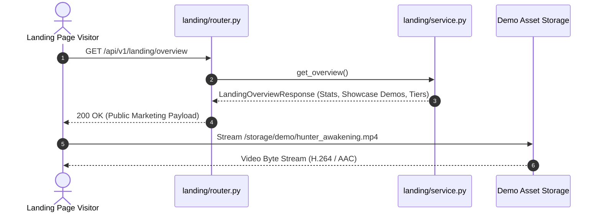

# Landing Feature Module

## 1. Overview
The **Landing** module serves public marketing data, video showcase reels, platform capabilities, global usage metrics, and subscription tiers to unauthenticated visitors and prospective creators. It mirrors the frontend `src/features/landing/` landing page and showcase components, allowing users to preview animations, discover platform features, and explore pricing options before creating an account.

---

## 2. Component Breakdown
- **`service.py`**: Compiles showcase reel metadata, static plan tiers, and platform statistics.
- **`router.py`**: Declares unauthenticated public REST endpoints for full overview bundles (`GET /overview`), video demo reels (`GET /showcase`), and pricing tiers (`GET /pricing`).
- **`schemas.py`**: Defines Pydantic data contracts for `ShowcaseSample`, `LandingStatsResponse`, `PricingTier`, and `LandingOverviewResponse`.
- **`__init__.py`**: Exposes the feature router and singleton service instance.

---

## 3. API Endpoints Table

| Method | Endpoint | Summary | Access Level | Description |
| :--- | :--- | :--- | :--- | :--- |
| `GET` | `/api/v1/landing/overview` | Landing Overview Bundle | Public | Returns combined showcase clips, platform stats, subscription tiers, and system version. |
| `GET` | `/api/v1/landing/showcase` | Showcase Demos | Public | Fetches demo videos showcasing AI animation, narration, and Ken Burns camera effects. |
| `GET` | `/api/v1/landing/pricing` | Pricing Tiers | Public | Details plan tiers, monthly/annual rates, and feature inclusions (4K exports, unlimited scraping). |

---

## 4. Mermaid Architecture & Sequence Diagram



---

## 5. Schemas & Data Contracts

### Pricing Tier Schema
```python
class PricingTier(BaseModel):
    id: str
    name: str
    price_monthly: float
    price_annual: float
    description: str
    popular: bool = False
    features: List[PricingFeature]
```

---

## 6. Error Handling & Edge Cases
- **Zero Authentication Required**: All landing endpoints operate without bearer tokens, ensuring rapid search engine crawler indexing and zero-friction guest discovery.
- **Static Asset Fallbacks**: Demo clips reference locally cached sample MP4s, preventing broken preview players.

---

## 7. Performance & Optimization
- **Zero Database Load**: Landing responses are constructed from static in-memory data structures, answering requests in under 1 millisecond.
- **Cache Header Friendly**: Payloads are ideal candidates for edge CDN and browser caching (e.g. `Cache-Control: public, max-age=3600`).
