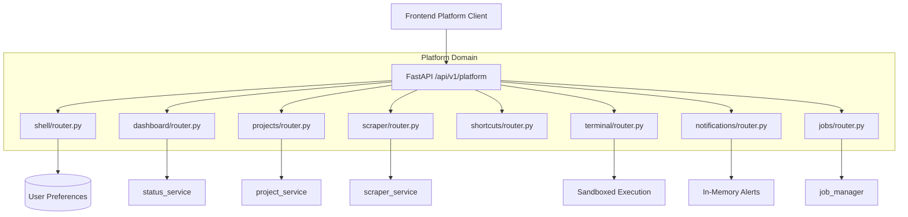

# Platform Domain Module

## 1. Overview
The **Platform Domain** encapsulates all platform-level application infrastructure, project workflows, background process tracking, system telemetry, and developer ergonomics. It directly mirrors the frontend architecture `src/features/platform/` 1:1, organizing outer application orchestration and peripheral services into modular, decoupled sub-domains.

---

## 2. Component Breakdown & Sub-Domain Architecture

```
features/platform/
├── shell/               # Navigation schemas, layout state, and user interface preferences
├── dashboard/           # Hardware telemetry, project overviews, quick metrics, and analytics
├── projects/            # Project lifecycle (CRUD), chapter structures, and asset references
├── scraper/             # Webtoon & manga scraping engine, chapter downloads, search
├── shortcuts/           # System-wide keyboard shortcut registry and custom user keybindings
├── terminal/            # Sandboxed web developer terminal, diagnostic commands, and logs
├── notifications/       # User notification feed, unread tracking, and system alerts
├── jobs/                # Background task execution polling, cancellation, and stage tracking
├── router.py            # Platform aggregate router mounting all 8 sub-domain routers
└── README.md            # Domain documentation and architectural overview
```

---

## 3. Sub-Domain Router Summary Table

| Sub-Domain | Base Path | Key Capabilities |
| :--- | :--- | :--- |
| **`shell`** | `/platform/shell` | Layout config, navigation tree filtering, user preference persistence. |
| **`dashboard`** | `/platform/dashboard` | Hardware resource stats, recent activity, system health overview. |
| **`projects`** | `/platform/projects` | Project creation, chapter hierarchy management, metadata updates. |
| **`scraper`** | `/platform/scraper` | Source provider discovery, manga search, chapter page extraction. |
| **`shortcuts`** | `/platform/shortcuts` | Keyboard keybinding registry, custom accelerator assignments. |
| **`terminal`** | `/platform/terminal` | Sandboxed diagnostics, FFmpeg probe, cache flushes (Admin only). |
| **`notifications`**| `/platform/notifications`| Notification feed, unread counters, mark-as-read, clear inbox. |
| **`jobs`** | `/platform/jobs` | Background task progress polling, lifecycle cancellation, filtering. |

---

## 4. Mermaid Architecture & Sequence Diagram



---

## 5. Schemas & Data Contracts
All sub-domains define strong Pydantic V2 models in their respective `schemas.py` files. Common cross-cutting models adhere to:
- Standard `success: bool` indicators.
- Strict ISO-8601 UTC timestamps (`created_at`, `updated_at`).
- Explicit pagination query parameters (`limit`, `offset`).

---

## 6. Error Handling & Edge Cases
- **Domain Isolation**: Errors in peripheral modules (e.g. Scraper network failure or Terminal command syntax error) never compromise core Project CRUD or Dashboard status responses.
- **Role Enforcement**: Sensitive sub-domains (such as `terminal`) enforce strict role validation via `api.dependencies.auth.get_current_user`, returning `HTTP 403 Forbidden` for non-administrative tokens.
- **Fail-Safe Fallbacks**: In-memory telemetry falls back gracefully to cached snapshots if hardware probing times out.

---

## 7. Performance & Optimization
- **Non-Blocking I/O**: Heavy operations (scraping, AI synthesis, video export) are queued onto the background `job_manager`, returning `202 Accepted` or job IDs immediately.
- **Modular Mounting**: Sub-routers are mounted as shallow trees, keeping FastAPI URL pattern resolution under 1ms.
