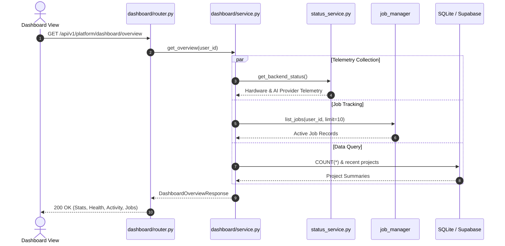

# Platform Dashboard Feature Module

## 1. Overview
The **Platform Dashboard** module provides aggregated system observability, user metrics, quick-action shortcuts, and workspace overview telemetries for the Sonikoma web application. It directly powers the frontend `src/features/platform/dashboard/` view by consolidating hardware status (CPU, RAM, GPU, Disk), active background task states from the Job Engine, recent project records, and storage breakdowns into a single high-efficiency endpoint.

---

## 2. Component Breakdown
- **`service.py`**: Interacts with `services.system.status_service`, `services.jobs.job_manager`, and the active SQL database engine to compile consolidated metrics and format human-readable storage sizes.
- **`router.py`**: Declares high-performance `/overview` endpoints providing unified telemetry payloads.
- **`schemas.py`**: Defines Pydantic data contracts for `DashboardQuickStats`, `SystemQuickHealth`, `DashboardRecentItem`, and `DashboardOverviewResponse`.
- **`__init__.py`**: Exposes the feature router and singleton service instance.

---

## 3. API Endpoints Table

| Method | Endpoint | Summary | Access Level | Description |
| :--- | :--- | :--- | :--- | :--- |
| `GET` | `/api/v1/platform/dashboard/overview` | Dashboard Overview | Public / Authenticated | Retrieves comprehensive dashboard overview including quick stats, hardware health, recent projects, and active background jobs. |

---

## 4. Mermaid Architecture & Sequence Diagram



---

## 5. Schemas & Data Contracts

### Quick Stats Schema
```python
class DashboardQuickStats(BaseModel):
    total_projects: int = 0
    active_jobs: int = 0
    total_images_processed: int = 0
    total_videos_rendered: int = 0
    storage_used_bytes: int = 0
    storage_used_formatted: str = "0 B"
```

### System Health Schema
```python
class SystemQuickHealth(BaseModel):
    status: str = "ok"  # ok, degraded, error
    uptime_seconds: float = 0.0
    cpu_percent: float = 0.0
    memory_percent: float = 0.0
    disk_percent: float = 0.0
    ai_available: bool = True
    gpu_available: bool = False
```

---

## 6. Error Handling & Edge Cases
- **Database Unavailability**: If the database query encounters a transient lock or connection error, the service gracefully falls back to empty project counts without failing the overall health payload.
- **Job Engine Liveness**: If the job manager is warming up, active jobs count defaults to 0 and logs a debug notice.
- **Hardware Telemetry Timeout**: If hardware probing exceeds threshold, the status is flagged as `"degraded"` with previous cached values.

---

## 7. Performance & Optimization
- **Parallel Aggregation**: Uses efficient in-memory caches from `status_service` for hardware telemetry to prevent disk/process spawn overhead.
- **Payload Compression**: Responses are serialized with minimal nested depths, keeping the total JSON response under 4KB for sub-10ms delivery.
