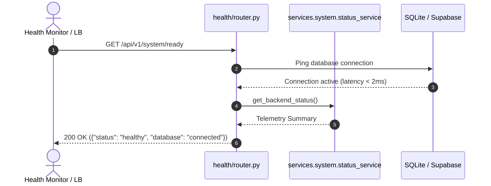

# Platform Health Feature Sub-Module

## 1. Overview
The **Platform Health** sub-module provides diagnostic health checks, telemetry endpoints, and system readiness probes for the Sonikoma platform backend. It allows container orchestrators, load balancers, and developer dashboards to verify database connectivity, filesystem write permissions, and GPU/CPU availability.

---

## 2. Component Breakdown
- **`router.py`**: Declares REST endpoints for liveness (`/health`), system readiness (`/ready`), and diagnostic status summaries (`/status`).
- **`__init__.py`**: Exposes the `health_router` for platform and API routing.

---

## 3. API Endpoints Table

| Method | Endpoint | Summary | Access Level | Description |
| :--- | :--- | :--- | :--- | :--- |
| `GET` | `/api/v1/system/health` | Liveness Probe | Public | Returns instant HTTP 200 `{"status": "ok"}` when the ASGI server is listening. |
| `GET` | `/api/v1/system/ready` | Readiness Probe | Public | Verifies active database connection pool and temporary filesystem mounts. |
| `GET` | `/api/v1/system/status` | Diagnostics | Public / Authenticated | Returns real-time hardware loads, memory stats, cache hit rates, and engine status. |

---

## 4. Mermaid Architecture Diagram



---

## 5. Schemas & Data Contracts

### Health Response
```python
class HealthResponse(BaseModel):
    status: str  # healthy, degraded, unhealthy
    timestamp: str
    version: str
    uptime_seconds: float
```

---

## 6. Error Handling & Edge Cases
- **Database Connection Failure**: Returns `HTTP 503 Service Unavailable` with diagnostic error message when database connection fails.
- **Degraded Status**: If non-critical services (e.g. optional external AI providers) are unreachable, reports `status: "degraded"` with HTTP 200.

---

## 7. Performance & Optimization
- **Lightweight Probes**: Liveness endpoints execute in sub-millisecond time without spawning subprocesses or allocating heap memory.
