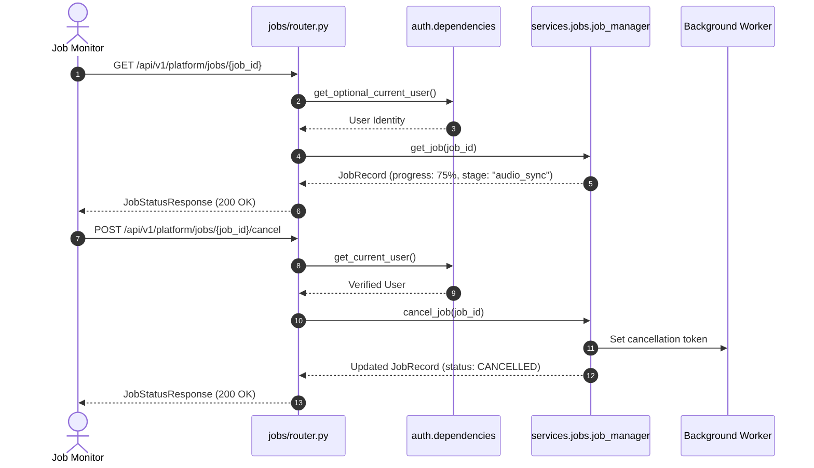

# Platform Jobs Feature Module

## 1. Overview
The **Platform Jobs** module provides centralized lifecycle management, real-time progress polling, stage tracking, and cancellation for asynchronous background tasks. It mirrors the frontend `src/features/platform/jobs/` architecture, enabling creators to monitor resource-intensive workloads including webtoon scraping, AI panel splitting, OCR extraction, audio synchronization, and video rendering.

---

## 2. Component Breakdown
- **`router.py`**: Declares canonical REST endpoints for job inspection (`GET /{job_id}`), task cancellation (`POST /{job_id}/cancel`), and paginated job listing with composite filters (`GET /`).
- **`service.py`**: Wraps the singleton `job_manager` (`services.jobs`) engine.
- **`schemas.py`**: Exports data contracts including `JobStatusResponse` and `JobListResponse`.
- **`__init__.py`**: Exposes the feature router for platform aggregation.

---

## 3. API Endpoints Table

| Method | Endpoint | Summary | Access Level | Description |
| :--- | :--- | :--- | :--- | :--- |
| `GET` | `/api/v1/platform/jobs/` | List Jobs | Authenticated / Guest | Lists background jobs with filtering by `project_id`, `chapter_id`, `status`, and `job_type`. |
| `GET` | `/api/v1/platform/jobs/{job_id}` | Job Status | Authenticated / Guest | Retrieves detailed execution state, active stage, progress percentage, and artifacts. |
| `POST` | `/api/v1/platform/jobs/{job_id}/cancel` | Cancel Job | Authenticated | Signals cooperative cancellation to an active or queued background worker. |

---

## 4. Mermaid Architecture & Sequence Diagram



---

## 5. Schemas & Data Contracts

### Job Status Response
```python
class JobStatusResponse(BaseModel):
    id: str
    type: str
    status: str  # QUEUED, RUNNING, COMPLETED, FAILED, CANCELLED
    progress_percent: int
    stage: Optional[str]
    error_message: Optional[str]
    created_at: str
    started_at: Optional[str]
    completed_at: Optional[str]
    metadata: Dict[str, Any]
```

---

## 6. Error Handling & Edge Cases
- **Non-Existent Jobs**: Requesting status for an invalid job ID returns an `HTTP 404 Not Found`.
- **Tenant Isolation**: Non-admin users attempting to inspect or cancel jobs owned by another user are rejected with `HTTP 403 Forbidden`.
- **Graceful Termination**: Cooperative cancellation allows workers to release locked file descriptors and clear temporary scratch files cleanly.

---

## 7. Performance & Optimization
- **Concurrent Polling**: Job statuses are tracked in an in-memory thread-safe registry, enabling high-frequency client polling (1-2s intervals) without disk or database overhead.
- **Index Pagination**: The `/` endpoint supports offset-based pagination and pre-filtered subsets to limit payload transfer overhead.
