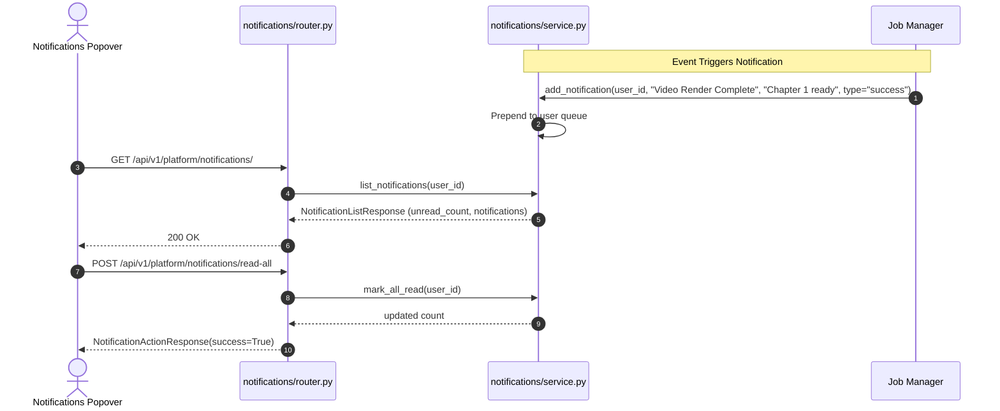

# Platform Notifications Feature Module

## 1. Overview
The **Platform Notifications** module provides notification feed management, read status tracking, and event alert synchronization for creators working in the Sonikoma workspace. It delivers real-time and persistent alerts regarding background job completion, scraper downloads, AI generation errors, and platform announcements directly to the frontend `src/features/platform/notifications/` notification bell and popover.

---

## 2. Component Breakdown
- **`service.py`**: Manages user notification queues, enforces FIFO retention policies (max 200 items per user), calculates unread counts, and mutates item read flags.
- **`router.py`**: Declares REST endpoints for listing notifications (`GET /`), marking individual alerts as read (`POST /{notif_id}/read`), batch marking as read (`POST /read-all`), and clearing the inbox (`DELETE /clear`).
- **`schemas.py`**: Defines Pydantic data contracts for `NotificationItem`, `NotificationListResponse`, and `NotificationActionResponse`.
- **`__init__.py`**: Exposes the router and singleton notification service instance.

---

## 3. API Endpoints Table

| Method | Endpoint | Summary | Access Level | Description |
| :--- | :--- | :--- | :--- | :--- |
| `GET` | `/api/v1/platform/notifications/` | List Notifications | Public / Authenticated | Retrieves current user notification list with unread counter. |
| `POST` | `/api/v1/platform/notifications/{id}/read` | Mark As Read | Public / Authenticated | Updates the read flag of a specific notification. |
| `POST` | `/api/v1/platform/notifications/read-all` | Mark All Read | Public / Authenticated | Marks all unread alerts for the active user as read. |
| `DELETE` | `/api/v1/platform/notifications/clear` | Clear Notifications | Public / Authenticated | Purges all notifications from the user's inbox. |

---

## 4. Mermaid Architecture & Sequence Diagram



---

## 5. Schemas & Data Contracts

### Notification Item Schema
```python
class NotificationItem(BaseModel):
    id: str
    user_id: str
    title: str
    message: str
    type: str = "info"  # info, success, warning, error
    read: bool = False
    created_at: str
    link: Optional[str] = None
    data: Optional[Dict[str, Any]] = None
```

---

## 6. Error Handling & Edge Cases
- **Missing Notification ID**: Marking an unrecognized `notif_id` as read returns an `HTTP 404 Not Found`.
- **Anonymous Sessions**: Guests receive session-scoped memory notifications; empty inboxes are pre-populated with a friendly onboarding notice.

---

## 7. Performance & Optimization
- **Ring Buffer Retention**: Bounded at 200 entries per user session, keeping memory consumption negligible (<50KB per active user).
- **Sub-Millisecond Polling**: Read updates and unread computations execute purely in-memory.
