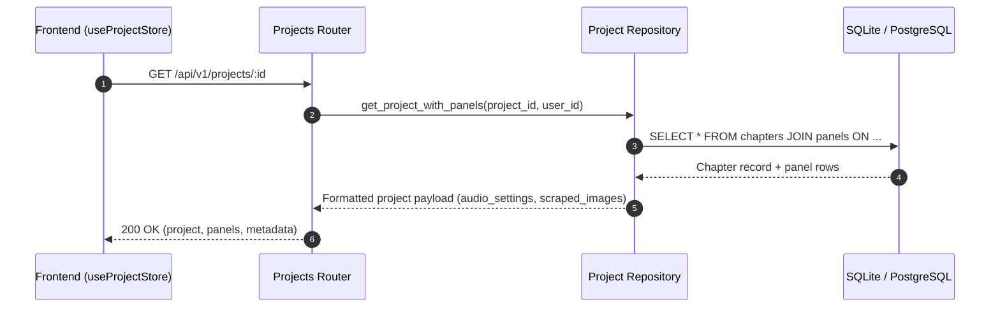

# Projects & Workspaces Sub-domain (`backend/app/features/platform/projects/`)

## 1. Overview & Architecture
The `projects` sub-domain manages comic series containers, chapter workspaces, panel orders, and workspace state persistence.

- **Primary Goal**: CRUD lifecycle of projects, chapter panel ordering, active project state caching, and workspace transfers.
- **Frontend Counterpart**: Maps directly to `frontend/src/features/platform/projects/` (`ProjectsPage.tsx`, `useProjectStore.ts`, `ProjectConfirmModal.tsx`).

---

## 2. Component Breakdown
- `router.py`: FastAPI endpoints for projects listing, creation, updates, and deletion.
- `app.repositories.project`: SQLAlchemy & SQLite queries mapping `series`, `chapters`, and `panels`.
- `schemas/project.py`: Validation contracts for project settings, chapter attributes, and panel lists.

---

## 3. Endpoints & API Contract Reference

| Method | Endpoint | Summary | Auth Required | Status Codes |
| :--- | :--- | :--- | :--- | :--- |
| `GET` | `/api/v1/projects` | List all user projects & chapter stats | Bearer JWT | 200, 401 |
| `POST` | `/api/v1/projects` | Create new project workspace | Bearer JWT | 201, 400, 401 |
| `GET` | `/api/v1/projects/{id}` | Retrieve project details & panels | Bearer JWT | 200, 404 |
| `PUT` | `/api/v1/projects/{id}` | Update title, metadata, or settings | Bearer JWT | 200, 400, 404 |
| `DELETE` | `/api/v1/projects/{id}` | Delete project workspace & assets | Bearer JWT | 200, 404 |
| `POST` | `/api/v1/projects/{id}/panels`| Append or reorder panel sequence | Bearer JWT | 200, 400 |

---

## 4. Execution Data Flow (Mermaid Diagram)

