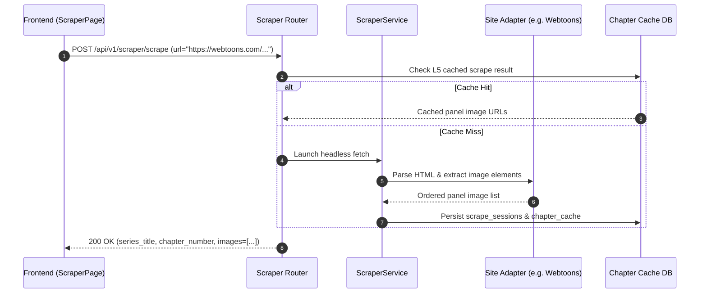

# Webtoon Scraper & Proxy Sub-domain (`backend/app/features/platform/scraper/`)

## 1. Overview & Architecture
The `scraper` sub-domain extracts chapters, metadata, and high-resolution vertical comic images from supported webtoon and manga reader sites.

- **Primary Goal**: Automated URL discovery, DOM parsing, Cloudflare-aware image proxying, and chapter list caching.
- **Frontend Counterpart**: Maps directly to `frontend/src/features/platform/scraper/` (`ScraperPage.tsx`, `useChapterIngestion.ts`).

---

## 2. Component Breakdown
- `router.py`: Handles scraping jobs, URL resolution, and image streaming through anti-blocking reverse proxies.
- `app.services.scraper.adapters`: Site-specific parsing adapters (Webtoons, Bato, MangaDex, Madara, Generic).
- `app.repositories.chapter_cache`: Caches discovered chapter lists in `chapter_cache` to reduce upstream rate-limiting.
- `app.repositories.scraper`: Persists scrape sessions in `scrape_sessions`.

---

## 3. Endpoints & API Contract Reference

| Method | Endpoint | Summary | Auth Required | Status Codes |
| :--- | :--- | :--- | :--- | :--- |
| `POST` | `/api/v1/scraper/scrape` | Trigger chapter scrape from URL | Optional | 200, 400, 422 |
| `GET` | `/api/v1/scraper/chapters` | Fetch cached series chapters | Optional | 200, 404 |
| `GET` | `/api/v1/scraper/domains` | List supported webtoon domains | No | 200 |
| `GET` | `/api/v1/proxy/image` | Proxy webtoon image with referrer bypass | No | 200, 404 |

---

## 4. Execution Data Flow (Mermaid Diagram)

