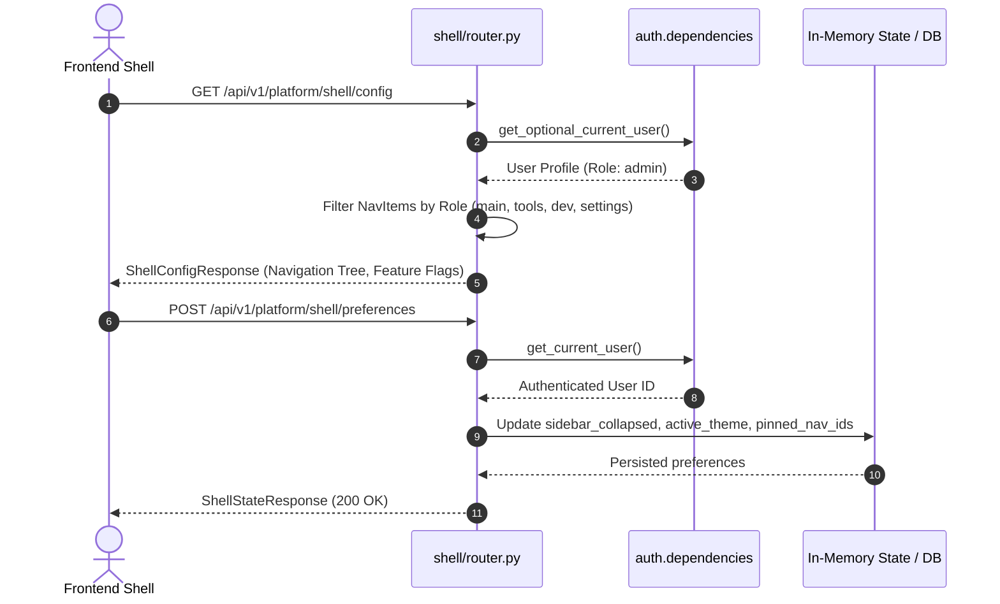

# Platform Shell Feature Module

## 1. Overview
The **Platform Shell** module provides the top-level orchestration, navigation schemas, environment configurations, and layout state persistence for the Sonikoma platform web interface. It mirrors the frontend `src/features/platform/shell/` architecture, ensuring that client-side layout drawers, navigation hierarchies, user theme states, and role-based route visibility are synchronized with backend permissions.

---

## 2. Component Breakdown
- **`router.py`**: Declares REST endpoints for shell configuration discovery (`/config`), layout state retrieval (`/state`), and layout preference mutations (`/preferences`).
- **`schemas.py`**: Defines Pydantic data contracts for `NavItem`, `ShellConfigResponse`, `ShellPreferencesUpdate`, and `ShellStateResponse`.
- **`__init__.py`**: Exposes the feature's modular APIRouter instance for mounting into the platform domain aggregator.

---

## 3. API Endpoints Table

| Method | Endpoint | Summary | Access Level | Description |
| :--- | :--- | :--- | :--- | :--- |
| `GET` | `/api/v1/platform/shell/config` | Shell Configuration | Public / Authenticated | Returns navigation tree, feature flags, default route, and environment mode. |
| `GET` | `/api/v1/platform/shell/state` | Shell Layout State | Authenticated / Guest | Fetches user layout preferences (collapsed sidebar, active theme, pinned items). |
| `POST` | `/api/v1/platform/shell/preferences` | Update Preferences | Authenticated | Persists modified theme, sidebar status, developer mode, and custom settings. |

---

## 4. Mermaid Architecture & Sequence Diagram



---

## 5. Schemas & Data Contracts

### Navigation Item (`NavItem`)
```python
class NavItem(BaseModel):
    id: str
    label: str
    icon: str
    path: str
    badge: Optional[str] = None
    section: str = "main"
    order: int = 0
    roles: List[str] = ["user", "admin"]
```

### Shell State (`ShellStateResponse`)
```python
class ShellStateResponse(BaseModel):
    sidebar_collapsed: bool = False
    active_theme: str = "dark"
    pinned_nav_ids: List[str] = []
    developer_mode: bool = False
    preferences: Dict[str, Any] = {}
```

---

## 6. Error Handling & Edge Cases
- **Anonymous Sessions**: Guests requesting `/config` or `/state` receive standard fallback navigation items with default dark theme without requiring an active token.
- **Role Invalidation**: If an unprivileged user attempts to modify or view protected routes, items with restricted `roles` are omitted from the navigation response.
- **Partial Updates**: The `/preferences` endpoint accepts partial payloads, preserving unset keys while applying only supplied changes.

---

## 7. Performance & Optimization
- **O(1) Route Resolution**: Navigation filtering executes in constant time using set intersections against small static navigation definitions.
- **Fast-Path State Lookup**: User layout state is cached in memory with lazy fallback to database storage, reducing latency under 5ms.
