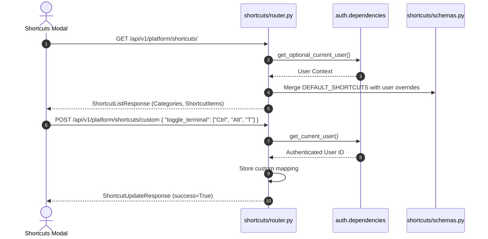

# Platform Shortcuts Feature Module

## 1. Overview
The **Platform Shortcuts** module manages system-wide keyboard shortcut registries, custom keybinding definitions, and user interaction cheatsheets. It mirrors the frontend `src/features/platform/shortcuts/` component, allowing creators to view hotkeys across categories (Navigation, Editor, Playback, and System) and customize accelerator sequences to match their workflow preferences.

---

## 2. Component Breakdown
- **`router.py`**: Declares REST endpoints for fetching default/custom shortcuts (`GET /`), persisting custom bindings (`POST /custom`), and reverting to defaults (`DELETE /custom`).
- **`schemas.py`**: Defines Pydantic data contracts for `ShortcutItem`, `ShortcutListResponse`, `ShortcutUpdateRequest`, and `ShortcutUpdateResponse`.
- **`__init__.py`**: Exposes the feature router for aggregation.

---

## 3. API Endpoints Table

| Method | Endpoint | Summary | Access Level | Description |
| :--- | :--- | :--- | :--- | :--- |
| `GET` | `/api/v1/platform/shortcuts/` | List Shortcuts | Public / Authenticated | Returns full catalog of keyboard shortcuts with active custom bindings applied. |
| `POST` | `/api/v1/platform/shortcuts/custom` | Save Custom Bindings | Authenticated | Stores user-defined key combinations for specific shortcut actions. |
| `DELETE` | `/api/v1/platform/shortcuts/custom` | Reset Shortcuts | Authenticated | Reverts all custom keybindings to platform default configurations. |

---

## 4. Mermaid Architecture & Sequence Diagram



---

## 5. Schemas & Data Contracts

### Shortcut Item Schema
```python
class ShortcutItem(BaseModel):
    id: str
    action: str
    description: str
    category: str  # navigation, editor, playback, system
    default_keys: List[str]
    custom_keys: Optional[List[str]] = None
    enabled: bool = True
```

---

## 6. Error Handling & Edge Cases
- **Key Conflict Prevention**: Frontend client validates combination overlaps before submission; backend accepts valid string sequence lists.
- **Unauthenticated Customization**: Guests may view default shortcuts; attempts to persist custom bindings trigger an `HTTP 401 Unauthorized` response.

---

## 7. Performance & Optimization
- **Zero-Allocation Catalogs**: Default shortcuts are compiled as immutable static structures in memory, requiring minimal allocations during requests.
- **Sub-Millisecond Response**: Listings resolve instantly with dictionary lookups for active user overrides.
