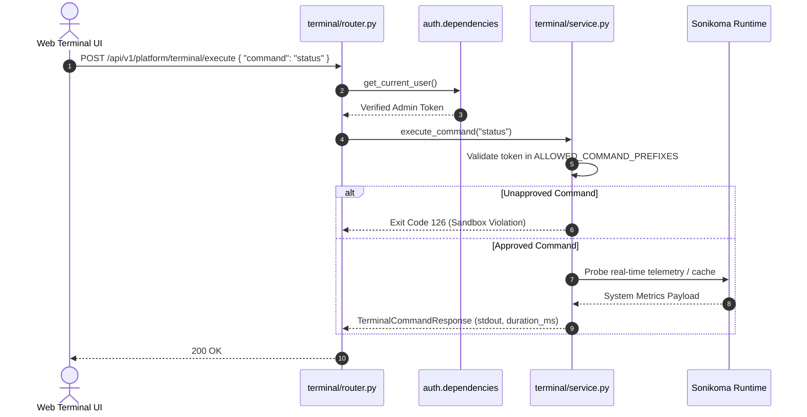

# Platform Terminal Feature Module

## 1. Overview
The **Platform Terminal** module provides an authenticated, sandboxed developer command environment embedded directly into the Sonikoma workspace. It mirrors `src/features/platform/terminal/` on the frontend, enabling operators and developers to safely run system diagnostics, check FFmpeg status, query telemetry, purge caches, and inspect running jobs without leaving the web application.

---

## 2. Component Breakdown
- **`service.py`**: Enforces strict sandbox isolation, validating command tokens against an approved whitelist (`status`, `health`, `cache`, `python`, `ffmpeg`, `jobs`, `help`), executing routines in isolated scopes, and collecting execution telemetry.
- **`router.py`**: Declares administrative REST routes for retrieving session parameters (`/info`), executing commands (`/execute`), and querying session history (`/history`).
- **`schemas.py`**: Defines Pydantic data contracts for `TerminalCommandRequest`, `TerminalCommandResponse`, and `TerminalSessionInfo`.
- **`__init__.py`**: Exposes the terminal router and service instance.

---

## 3. API Endpoints Table

| Method | Endpoint | Summary | Access Level | Description |
| :--- | :--- | :--- | :--- | :--- |
| `GET` | `/api/v1/platform/terminal/info` | Session Info | Admin / Developer | Returns allowed sandbox commands, working directory, and interpreter version. |
| `POST` | `/api/v1/platform/terminal/execute` | Execute Command | Admin / Developer | Executes an approved maintenance command in the sandbox and streams output. |
| `GET` | `/api/v1/platform/terminal/history` | Command History | Admin / Developer | Fetches recent command execution logs with exit codes and timings. |

---

## 4. Mermaid Architecture & Sequence Diagram



---

## 5. Schemas & Data Contracts

### Execution Request & Response
```python
class TerminalCommandRequest(BaseModel):
    command: str
    cwd: Optional[str] = None

class TerminalCommandResponse(BaseModel):
    command: str
    exit_code: int
    stdout: str
    stderr: str
    execution_time_ms: float
    timestamp: str
```

---

## 6. Error Handling & Edge Cases
- **Non-Admin Access**: Users without `"admin"` or `"developer"` roles receive an immediate `403 Forbidden` response.
- **Arbitrary Command Injection**: Commands are checked against a strict prefix whitelist. Shell metacharacters and unlisted executables are rejected with exit code 126.
- **Command Timeouts**: Subprocesses are bounded with hard timeouts (e.g. 5 seconds for FFmpeg probe) to prevent thread exhaustion.

---

## 7. Performance & Optimization
- **Ring Buffer History**: Session history is capped at 100 entries in memory, preventing unbounded memory growth.
- **Sub-5ms Sandbox Parsing**: Native Python command dispatch bypasses OS shell spawning for internal diagnostics.
