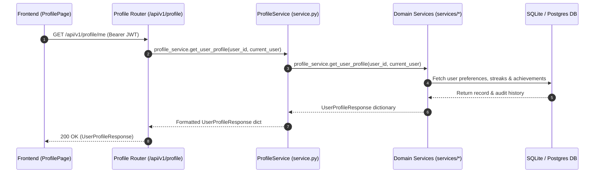

# Creator Profile & Account Feature (`backend/features/profile/`)

## 1. Overview & Architecture
The `features/profile` domain manages user identity customization, avatar uploads, studio UI preferences, gamification credits, billing history, and developer API credentials.

- **Primary Goal**: Provide a clean, modular architecture separating HTTP routing, domain services, and Pydantic validation:
  - **Service**: Domain business logic separated into modular services under `services/` with a unified facade in `service.py`.
  - **Schemas**: Canonical Pydantic schemas in `schemas.py`.
  - **Router**: Modular sub-routers organized under `router/` and exposed via `router/__init__.py`.
  - **README**: Comprehensive feature documentation and API contracts.
- **Frontend Counterpart**: Directly supports `frontend/src/features/profile/` (`ProfilePage.tsx`, `ProfileAccountTab.tsx`, `ProfileSecurityTab.tsx`, `useCredits.ts`).

---

## 2. Directory Layout & Module Structure

```
backend/features/profile/
├── __init__.py           # Unified exports: router, profile_router, ProfileService, profile_service, schemas, services
├── service.py            # ProfileService class & singleton instance profile_service (facade)
├── schemas.py            # Canonical Pydantic schemas (profile, credits, preferences, API keys)
├── router/               # Sub-routers directory
│   ├── __init__.py       # Aggregated profile_router / router
│   ├── profile.py        # /me, /profile, /sessions, /invoices, /audit-logs, /claim-daily-credits
│   ├── avatar.py         # /avatar/upload, /avatar/youtube-refresh
│   ├── preferences.py    # /preferences, /mfa, /redeem-points, /upgrade-plan, /credits, /analytics
│   └── api_keys.py       # /api-keys (list, generate, revoke)
├── services/             # Specialized domain services
│   ├── __init__.py       # Services aggregator package
│   ├── credit_service.py # Credit balance, ledger, transactions, streak claims, purchasing
│   ├── profile_service.py# Profile details, sessions, deletion, audit logs, analytics, achievements
│   ├── avatar_service.py # Custom avatar upload & YouTube OAuth sync
│   ├── preference_service.py # Points redemption, MFA toggling, payment cards, plan upgrades
│   └── api_key_service.py# Developer API key generation, listing, revocation
└── README.md             # Architecture, service patterns, and API documentation
```

---

## 3. Endpoints & API Contract Reference

All endpoints are mounted under `/api/v1/profile`:

| Method | Endpoint | Summary | Request Model | Response Model | Service Handler |
| :--- | :--- | :--- | :--- | :--- | :--- |
| `GET` | `/me` | Get authenticated user profile details | None | `UserProfileResponse` | `profile_service.get_user_profile` |
| `PUT` | `/profile` | Update profile settings & social links | `ProfileUpdate` | `dict` | `profile_service.update_user_profile` |
| `POST` | `/claim-daily-credits` | Claim daily login streak bonus | None | `ClaimDailyCreditsResponse` | `credit_service.claim_daily_credits` |
| `DELETE` | `/me` | Permanently delete account | None | `StandardMessageResponse` | `profile_service.delete_account` |
| `GET` | `/sessions` | List active device sessions | None | `dict` | `profile_service.get_user_sessions` |
| `DELETE` | `/sessions/{session_id}` | Terminate specific device session | Path `session_id` | `dict` | `profile_service.terminate_session` |
| `GET` | `/audit-logs` | Get personal security audit logs | Query params | `dict` | `profile_service.get_user_audit_logs` |
| `GET` | `/invoices` | Get billing receipt & invoice history | None | `dict` | `profile_service.get_user_invoices` |
| `POST` | `/avatar/upload` | Upload custom avatar image | Multipart `file` | `dict` | `avatar_service.upload_avatar` |
| `POST` | `/avatar/youtube-refresh` | Sync avatar logo from YouTube API | None | `dict` | `avatar_service.refresh_youtube_avatar` |
| `POST` | `/redeem-points` | Exchange points for credits or badges | `RedeemPointsRequest` | `dict` | `preference_service.redeem_points` |
| `PUT` | `/mfa` | Toggle 2FA authentication | `MfaUpdate` | `dict` | `preference_service.toggle_mfa` |
| `POST` | `/save-card` | Save billing payment card details | `SaveCardRequest` | `dict` | `preference_service.save_card` |
| `POST` | `/upgrade-plan` | Upgrade account to Studio Pro tier | None | `dict` | `preference_service.upgrade_plan` |
| `POST` | `/purchase-credits` | Purchase compute credits | `PurchaseCreditsRequest` | `dict` | `credit_service.purchase_credits` |
| `GET` | `/credits` | Check remaining credits balance | None | `CreditsBalanceResponse` | `credit_service.get_credit_balance` |
| `GET` | `/transactions` | Credit transactions history | None | `dict` | `credit_service.get_credit_transactions` |
| `GET` | `/analytics` | Creator performance metrics & heatmap | None | `dict` | `profile_service.get_creator_analytics` |
| `GET` | `/api-keys` | List developer API keys | None | `dict` | `api_key_service.list_api_keys` |
| `POST` | `/api-keys` | Generate new developer API key | `ApiKeyCreate` | `dict` | `api_key_service.generate_api_key` |
| `DELETE` | `/api-keys/{key_id}` | Revoke developer API key | Path `key_id` | `dict` | `api_key_service.revoke_api_key` |

---

## 4. Execution Data Flow (Mermaid Diagram)



---

## 5. Domain Schemas (`schemas.py`)
- **`UserProfileResponse`**: Complete profile model with roles, social connections, gamification points, and preferences.
- **`ProfileUpdate`**: Partial update model with validation for avatar URL, bio, portfolio links, and preferences.
- **`UserPreferences`**: Theme mode, autosave interval, preferred TTS voice model.
- **`ApiKeyCreate` & `ApiKeyResponse`**: Developer API token issuance and metadata.
- **`CreditsBalanceResponse` & `ClaimDailyCreditsResponse`**: Compute ledger and daily claim responses.
