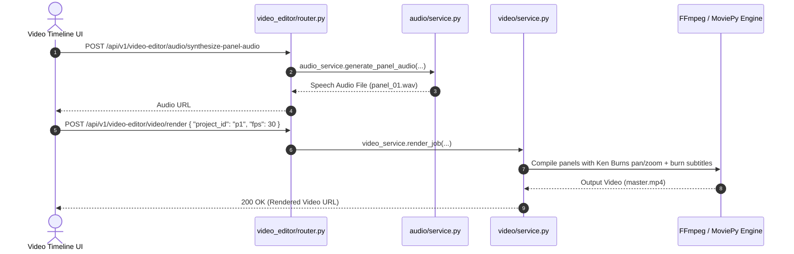

# Video Editor Feature Module

## 1. Overview
The **Video Editor** module is the high-performance media assembly engine of Sonikoma. It transforms static comic panel crops and storyboard scripts into fully orchestrated, voice-acted cinematic animation videos. It drives dynamic timeline previews, Ken Burns camera motions (pans, zooms, camera shakes), multi-character TTS voice synthesis, audio cross-fading, background music ducking, and burn-in subtitle rendering.

---

## 2. Standardized Architecture

The module is partitioned into two self-contained sub-domains: `video/` and `audio/`, orchestrated by a top-level facade.

```
features/video_editor/
├── __init__.py           # Unified exports (routers, services, schemas)
├── router.py             # Top-level /video-editor APIRouter mounting sub-routers
├── schemas.py            # Aggregate schema exports (combines video and audio schemas)
├── service.py            # VideoEditorService facade combining VideoService & AudioService
├── README.md             # Architecture documentation
│
├── video/                # Video sub-domain
│   ├── __init__.py       # Video sub-domain exports
│   ├── README.md         # Video sub-domain documentation
│   ├── router.py         # Sub-router mounting render and ffmpeg endpoints
│   ├── schemas.py        # Video Pydantic schemas and filter/transition types
│   ├── service.py        # VideoService facade class & video_service singleton
│   └── services/         # Separated video compilation & rendering engines
│       ├── frame_builder.py # Frame layout, letterboxing, blur & subtitle overlays
│       ├── motion_engine.py # Cinematic camera motions (pan, zoom, camera shake)
│       ├── video_compiler.py# Multi-panel sequence assembly & FFmpeg encoder
│       ├── render_job.py # Asynchronous render job workflow
│       └── __init__.py   # Services re-export
│
└── audio/                # Audio sub-domain
    ├── __init__.py       # Audio sub-domain exports
    ├── README.md         # Audio sub-domain documentation
    ├── router/           # Audio route handlers (sub-package for multiple endpoints)
    │   ├── alignment.py  # Dialogue OCR and audio waveform alignment endpoints
    │   ├── analysis.py   # Audio signal feature analysis & energy segmentation endpoints
    │   ├── mixer.py      # Multi-track mixing & ducking endpoints
    │   ├── settings.py   # Audio settings and preset endpoints
    │   ├── transcription.py # Whisper speech transcriber and subtitle generator endpoints
    │   ├── tts.py        # Text-to-speech generation and voice audition endpoints
    │   └── __init__.py   # Assembles audio_router
    ├── schemas.py        # Audio Pydantic schemas (TTS, Transcribe, Alignment, etc.)
    ├── service.py        # AudioService facade class & audio_service singleton
    └── services/         # Core audio engine implementations
        ├── alignment.py  # Dialogue aligner and peak extractor
        ├── processing.py # Librosa audio signal processor
        ├── transcription.py # Whisper speech transcriber and subtitle generator
        ├── tts.py        # Edge-TTS voice generation engine
        └── __init__.py   # Audio engines re-export
```

---

## 3. API Endpoints Table

| Method | Endpoint | Summary | Access Level | Description |
| :--- | :--- | :--- | :--- | :--- |
| `POST` | `/api/v1/video-editor/video/render` | Render Video | Authenticated | Queues full FFmpeg rendering job to produce MP4 video from storyboard frames. |
| `POST` | `/api/v1/video-editor/audio/synthesize-panel-audio` | Synthesize Speech | Authenticated | Synthesizes spoken voiceover audio for a specific comic dialogue panel. |
| `GET` | `/api/v1/video-editor/audio/list-tts-voices` | List TTS Voices | Public / Auth | Lists available neural voices across supported languages and styles. |
| `POST` | `/api/v1/video-editor/audio/preview-tts-voice` | Preview Voice | Public / Auth | Streams quick voice audition snippet for creator voice selection. |
| `POST` | `/api/v1/video-editor/audio/mix-audio-tracks` | Mix Tracks | Authenticated | Blends dialogue, background score, and sound effects with automatic ducking. |
| `POST` | `/api/v1/video-editor/audio/generate-srt-subtitles` | Generate Subtitles| Authenticated | Generates timed SRT/VTT subtitles matching narration audio boundaries. |
| `POST` | `/api/v1/video-editor/audio/synchronize-dialogue/{panel_id}` | Synchronize Dialogue | Authenticated | Aligns speech bubble OCR text against audio timestamps. |
| `POST` | `/api/v1/video-editor/audio/analyze-audio` | Analyze Audio | Authenticated | Computes spectral features and energy envelopes for audio files. |

---

## 4. Mermaid Architecture & Sequence Diagram



---

## 5. Clean Feature Architecture
The `services_audio` and `services_video` directories have been migrated directly into their respective sub-domains (`audio/services` and `video/`), providing a unified and decoupled structure across all video and audio operations.
