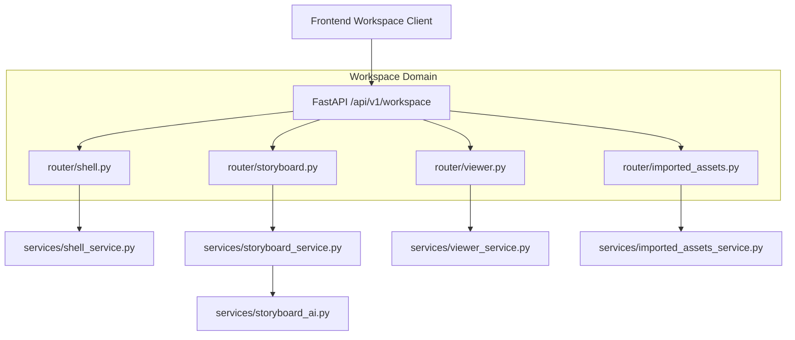

# Workspace Domain Module (`backend/features/workspace/`)

## 1. Overview & Architecture
The **Workspace Domain** provides canvas orchestration, interactive comic storyboarding, reader previewing, and asset management for creators producing comic-to-video episodes. It establishes 1:1 symmetry with the frontend `src/features/workspace/` architecture, separating canvas layout management, multimodal scene timeline generation, raw webtoon chapter viewing, and local media uploads into dedicated sub-domains.

Following the project's standard clean architecture (consistent with `admin/`, `auth/`, `profile/`, and `image_editor/`), the domain centers around three primary pillars:
- `schemas.py`: Canonical Pydantic schemas for workspace shell context, modes, storyboard sequences, reader viewports, and imported media assets.
- `services/`: Modular service layer (`shell_service`, `storyboard_service`, `storyboard_ai`, `viewer_service`, `imported_assets_service`).
- `router/`: Modular FastAPI routers (`shell`, `storyboard`, `viewer`, `imported_assets`, and aggregated `router.py`).

---

## 2. Component Breakdown & Directory Structure

```
backend/features/workspace/
├── __init__.py            # Unified package exports: routers, services, schemas
├── schemas.py             # Canonical Pydantic schemas (WorkspaceContextResponse, StoryboardData, etc.)
├── router/                # Sub-domain and aggregate route handlers
│   ├── __init__.py        # Exports all sub-domain and master routers
│   ├── router.py          # Master router mounting /shell, /storyboard, /viewer, /imported-assets
│   ├── shell.py           # Canvas viewport, zoom ratios, tool modes, and session context
│   ├── storyboard.py      # AI scene breakdown, voiceover script generation, audio cues
│   ├── viewer.py          # Webtoon continuous vertical reader, manga reader, scroll position tracking
│   └── imported_assets.py # Project media gallery, multipart asset upload, disk indexing
├── services/              # Domain business services
│   ├── __init__.py        # Service package exports
│   ├── shell_service.py   # Workspace editor shell session state and viewport layout
│   ├── storyboard_service.py # Storyboard job lifecycle and persistence
│   ├── storyboard_ai.py   # AI multimodal narrative generator and fallback builder
│   ├── viewer_service.py  # Chapter page delivery and reading progress tracker
│   └── imported_assets_service.py # Disk media asset storage and discovery
└── README.md              # Domain documentation and architectural overview
```

---

## 3. Sub-Domain Router Summary Table

| Sub-Domain | Base Path | Key Capabilities |
| :--- | :--- | :--- |
| **`shell`** | `/workspace/shell` | Active project context, canvas zoom, panel split orientation, mode switching. |
| **`storyboard`** | `/workspace/storyboard` | Asynchronous AI storyboard generation, scene editing, audio cues, timing. |
| **`viewer`** | `/workspace/viewer` | Chapter image delivery, reading orientation (webtoon/manga), scroll progress. |
| **`imported_assets`**| `/workspace/imported-assets`| Multipart file uploads, disk scanning, media metadata, asset deletion. |

---

## 4. Mermaid Architecture & Sequence Diagram


