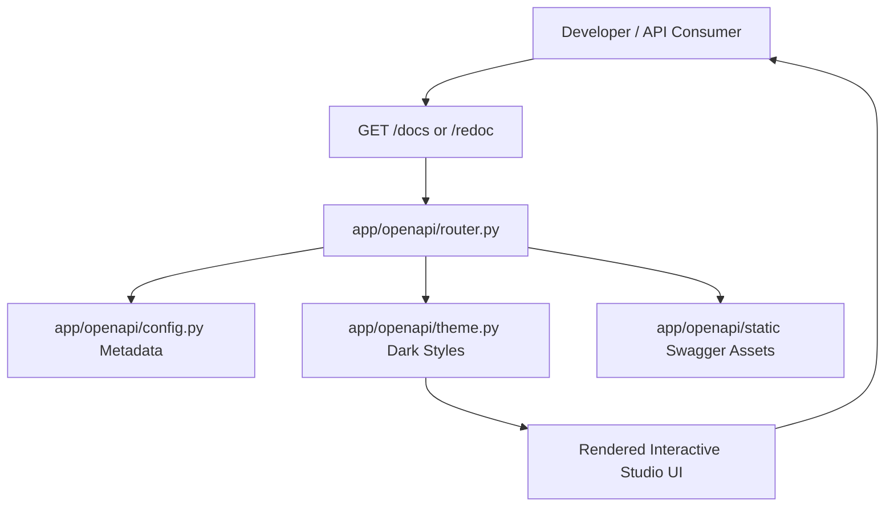

# OpenAPI & Interactive Documentation (`backend/app/openapi/`)

## 1. Overview
The `app.openapi` package provides customized, branded interactive API documentation and schema generators for the Sonikoma engine. It replaces default FastAPI Swagger/Redoc styling with a dark-mode theme, developer sandboxes, schema categorization, and comprehensive OpenAPI v3 metadata generation.

---

## 2. Component Breakdown
- **`config.py`**: OpenAPI schema metadata configuration, version tags, contact information, license specifications, and server URL definitions.
- **`router.py`**: Custom route handlers serving themed documentation portals (`/docs`, `/redoc`, `/openapi.json`).
- **`assets.py`**: Shared loaders for static CSS/JS files and template helpers for consistent sidebar generation.
- **`renderers.py`**: HTML page renderers for Swagger UI, ReDoc, schema explorer, and the test portal.
- **`theme.py`**: Backward-compatible facade that keeps the route layer stable while delegating to the split renderer modules.
- **`static/`**: Bundled offline Swagger UI assets (CSS, JS bundle, favicon) allowing documentation access even in air-gapped environments.
- **`templates/`**: HTML Jinja2 templates for custom Swagger UI and interactive documentation layouts.

---

## 3. Documentation Endpoints

| Method | Endpoint | Description |
| :--- | :--- | :--- |
| `GET` | `/docs` | Custom branded dark-mode Swagger UI interactive console. |
| `GET` | `/redoc` | High-readability ReDoc reference documentation. |
| `GET` | `/openapi.json` | Raw OpenAPI v3 JSON schema specification for client generators. |

---

## 4. Mermaid Architecture Diagram

---

## 5. Security & Production Controls
- OpenAPI documentation endpoints can be selectively disabled in production environments by toggling `ENABLE_DOCS=False` in environment settings to minimize public API surface exposure.
- Sensitive internal endpoints (e.g. raw shell execution or secret rotation) are decorated with `include_in_schema=False` where appropriate.

---

## 6. Performance & Optimization
- **Offline Static Bundling**: Swagger CSS and JavaScript files are served locally from `openapi/static/` rather than third-party CDNs, ensuring sub-10ms documentation page loads and resilience against CDN outages.
- **Cached Schema Generation**: The OpenAPI JSON schema dictionary is computed lazily and cached in memory across server requests.
