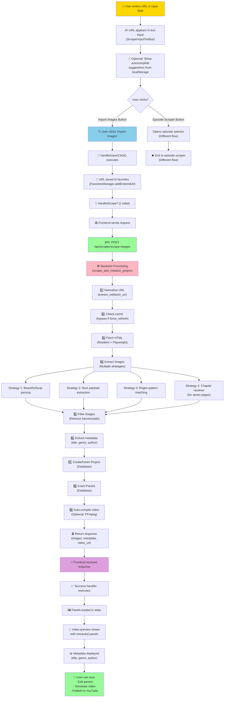

# User URL Entry Flow: Initialize New Video Pipeline

## 📋 Overview
This document visualizes the complete data flow when a user enters a URL in the **"Initialize New Video Pipeline"** section and clicks **Import Images**.

---

## 🎬 Visual Flow Diagram



---

## 🔄 Step-by-Step Breakdown

### **1. USER INPUT STAGE** 👤
```typescript
// File: ScraperInputToolbar.tsx

// User types URL
<input
  value={targetUrl}
  onChange={(e) => setTargetUrl(e.target.value)}
  onPaste={handlePaste}
  placeholder="Paste any Manhwa, Manga, Webtoon, or Webcomic reader URL..."
/>

// Autocomplete suggestions shown from recent/bookmarked URLs
// Loaded from localStorage via FavoritesManager
```

**What happens:**
- URL input triggers state update
- Suggestions dropdown appears (if enabled)
- User can select a previous URL or continue typing

---

### **2. USER ACTION - IMPORT IMAGES** 🔍
```typescript
// File: ScraperInputToolbar.tsx

const handleImportClick = () => {
  if (!targetUrl.trim()) return;
  
  // Save URL to favorites
  FavoritesManager.addEnteredUrl(targetUrl.trim());
  
  // Trigger scraping
  handleScrape?.();
};

// Button click
<button onClick={handleImportClick} disabled={isScraping}>
  {isScraping ? "Extracting..." : "Import Images"}
</button>
```

**What happens:**
- URL saved to browser localStorage
- Loading state activated (button shows "Extracting...")
- Backend request triggered

---

### **3. FRONTEND API REQUEST** 📤
```typescript
// File: useAppLogic.ts (scrapeImages hook)

const scrapeImages = useCallback(
  async (customUrl?: string) => {
    const activeUrl = customUrl || targetUrl;
    
    // Normalize and validate URL
    const resolvedUrl = convertToViewerUrl(activeUrl, chapterNumber.trim());
    const normalizedTargetUrl = extractWebtoonUrl(resolvedUrl);
    
    // API Call
    const response = await fetch("/api/scraper/scrape-images", {
      method: "POST",
      headers: { "Authorization": `Bearer ${token}` },
      body: JSON.stringify({
        url: normalizedTargetUrl,
        source: detectedSource,
        project_id: activeProjectId,
        smart_slice: true,
        limit: 50,
        proxy_images: true,
        filter_banners: true,
        include_metadata: true
      })
    });
    
    const data = await response.json();
    
    // Update state with results
    setPanels(data.panels);
    setMetadata(data.metadata);
    if (data.video_url) setVideoUrl(data.video_url);
  },
  [targetUrl, chapterNumber, activeProjectId]
);
```

**What happens:**
- URL normalized (extra whitespace, protocol fixes)
- Source detected (Webtoon, Manga, etc.)
- POST request sent to backend
- Loading state maintained

---

### **4. BACKEND PROCESSING** 🛠️
```python
# File: backend/app/api/v1/scraper.py

@router.post("/scrape-images")
async def scrape_images(request: Request, body: ScrapeImagesRequest):
    """
    Main scraper endpoint that orchestrates:
    1. URL validation
    2. Image extraction
    3. Metadata parsing
    4. Project creation
    5. Database insertion
    6. Video compilation (optional)
    """
    
    # Call scraper service
    result = await scrape_and_initialize_project(
        url=body.url,
        source=body.source,
        project_id=body.project_id,
        user_id=user_id,
        smart_slice=body.smart_slice,
        limit=body.limit,
        proxy_images=body.proxy_images,
        filter_banners=body.filter_banners,
        include_metadata=body.include_metadata
    )
    
    return result
```

**What happens:**
- URL validation
- Cache checking (bypassed if force_refresh=true)
- Scraper service invoked

---

### **5. IMAGE EXTRACTION** 🔍
```python
# File: backend/app/services/scraper/scraper.py

async def scrape_images_from_url(url, ...):
    """
    Multi-strategy image extraction pipeline
    """
    
    # Step 1: Fetch HTML
    html = await try_fetch_url_resilient(
        fetch_url,
        fetch_headers,
        cookies=merged_cookies
    )
    
    if not html:
        html = await try_fetch_with_playwright(  # Fallback
            fetch_url,
            user_agent=fetch_headers["User-Agent"],
            referer=fetch_headers["Referer"],
            cookies=merged_cookies
        )
    
    # Step 2: Extract Metadata
    metadata = extract_metadata(html, fetch_url)
    # Returns: title, genre, author, cover_image, etc.
    
    # Step 3: Multi-strategy Image Extraction
    image_dict = {}
    
    # Strategy 1: BeautifulSoup parsing
    bs4_imgs = parse_with_bs4(html, fetch_url)
    for img in bs4_imgs:
        image_dict[img] = True
    
    # Strategy 2: Nuxt payload extraction (modern SPAs)
    nuxt_imgs = extract_images_from_nuxt_payload(html)
    for img in nuxt_imgs:
        image_dict[img] = True
    
    # Strategy 3: Regex pattern matching (as fallback)
    if len(image_dict) < 15:
        loose_regex = [
            r'https?://[^\s"\']+\.(?:png|jpg|jpeg|webp)',
            r'"url"\s*:\s*"([^"]+)"',
            ...
        ]
        # Extract via regex
    
    # Strategy 4: Chapter resolver (for series pages)
    if len(image_dict) < 2:
        # Find chapter links on series page
        # Navigate to first chapter
        # Extract images from chapter
    
    # Step 4: Filter images
    def filter_images(urls):
        UNWANTED_PATTERNS = [
            'logo', 'watermark', 'banner', 'ad', 'advertisement',
            'nav', 'header', 'sidebar', 'comment', 'avatar'
        ]
        return [url for url in urls 
                if not any(pat in url.lower() for pat in UNWANTED_PATTERNS)]
    
    filtered_images = filter_images(list(image_dict.keys()))
    
    # Step 5: Proxy images (optional)
    if proxy_images:
        filtered_images = [
            f"/api/proxy-image?url={quote(img)}&referer={quote(fetch_url)}"
            for img in filtered_images
        ]
    
    return filtered_images
```

**What happens:**
- HTML fetched from URL (with retries and fallbacks)
- Four different extraction strategies applied
- Images filtered for quality (remove ads/banners)
- Images proxied through backend (optional)

---

### **6. DATABASE OPERATIONS** 💾
```python
# File: backend/app/services/scraper/scraper_service.py

async def scrape_and_initialize_project(...):
    """
    Create or update project in database
    """
    
    # Generate project ID or use provided one
    resolved_project_id = project_id or f"proj_{uuid.uuid4().hex[:8]}"
    
    # Get/create project
    existing_project = get_project(resolved_project_id)
    
    if existing_project:
        # Update existing project
        update_project(resolved_project_id, {
            "status": "draft",
            "panels_count": len(panels),
            "updated_at": datetime.now()
        })
    else:
        # Create new project
        insert_project({
            "project_id": resolved_project_id,
            "user_id": user_id,
            "title": metadata.get("title", "Untitled"),
            "genre": metadata.get("genre", ""),
            "author": metadata.get("author", ""),
            "cover_image": metadata.get("cover_image", ""),
            "status": "draft",
            "panels_count": len(panels),
            "created_at": datetime.now()
        })
    
    # Insert all panels
    for idx, panel_url in enumerate(panel_urls):
        insert_panel({
            "project_id": resolved_project_id,
            "panel_index": idx,
            "image_url": panel_url,
            "imported_at": datetime.now()
        })
    
    # Optional: Auto-compile video
    if not scrape_only:
        video_url = await compile_video_from_panels(
            resolved_project_id,
            panels,
            output_dir="/data/media"
        )
    
    return {
        "project_id": resolved_project_id,
        "status": "success",
        "panels": panel_data,
        "metadata": metadata,
        "video_url": video_url or None,
        "panels_count": len(panels)
    }
```

**What happens:**
- Project created/updated in database
- All panels inserted with metadata
- Video optionally compiled
- Results returned to frontend

---

### **7. FRONTEND RESPONSE HANDLING** 📨
```typescript
// File: useAppLogic.ts

// Response received
const data = await response.json();

// Update application state
setPanels(data.panels);
setSeriesTitle(data.metadata?.title);
setScrapedGenre(data.metadata?.genre);
setSeriesAuthor(data.metadata?.author);
setSeriesCoverImage(data.metadata?.cover_image);

// Update active project context
if (data.project_id) {
  setActiveProjectId(data.project_id);
  await hydrateActiveProject(data.project_id);
}

// Set video URL if compilation was done
if (data.video_url) {
  setVideoUrl(data.video_url);
}

// Show success notification
addNotification(
  `✅ Successfully imported ${data.panels_count} panels!`,
  "success"
);
```

**What happens:**
- State updated with panels and metadata
- Active project set
- Video preview shows (if available)
- User notified of success

---

## 📊 State Flow

```
┌─────────────────────────────────────────────────────────────┐
│ BEFORE: URL Entry                                           │
├─────────────────────────────────────────────────────────────┤
│ targetUrl: ""                                               │
│ panels: []                                                  │
│ seriesTitle: ""                                             │
│ videoUrl: null                                              │
│ isScraping: false                                           │
└─────────────────────────────────────────────────────────────┘
         ↓ (User enters URL and clicks "Import Images")
┌─────────────────────────────────────────────────────────────┐
│ DURING: Scraping (Loading State)                           │
├─────────────────────────────────────────────────────────────┤
│ targetUrl: "https://www.webtoon.com/en/..."                │
│ panels: []                                                  │
│ isScraping: true                 ← Loading state            │
│ progressMessage: "Extracting..."                            │
└─────────────────────────────────────────────────────────────┘
         ↓ (Backend processes)
┌─────────────────────────────────────────────────────────────┐
│ AFTER: Success                                              │
├─────────────────────────────────────────────────────────────┤
│ targetUrl: "https://www.webtoon.com/en/..."                │
│ panels: [                                                   │
│   { id: 1, image_url: "...", duration: 4.5, ... },        │
│   { id: 2, image_url: "...", duration: 4.5, ... },        │
│   { id: 3, image_url: "...", duration: 4.5, ... },        │
│   ...                                                       │
│ ]                                                           │
│ seriesTitle: "Tower of God"                                 │
│ scrapedGenre: "Action, Fantasy"                             │
│ seriesAuthor: "SIU"                                         │
│ seriesCoverImage: "..."                                     │
│ activeProjectId: "proj_abc12345"                            │
│ videoUrl: "/videos/tower_of_god_ep1_compiled_xyz.mp4"      │
│ isScraping: false               ← Loading done              │
│ notification: "✅ Imported 45 panels!"                      │
└─────────────────────────────────────────────────────────────┘
```

---

## 🎯 Visible User Experience

### **1. Input Stage**
```
┌─────────────────────────────────────────────────────────────┐
│  📍 Initialize New Video Pipeline                           │
├─────────────────────────────────────────────────────────────┤
│                                                              │
│  Input Field:                                               │
│  ┌─────────────────────────────────────────────────────────┐
│  │ Paste any Manhwa, Manga, Webtoon URL...               │
│  │ https://www.webtoon.com/en/fantasy/tower-of-god/...  │
│  │                                                         │
│  │ [Suggestions dropdown]                                  │
│  │ • Tower of God - Chapter 1                             │
│  │ • Solo Leveling - Chapter 3                            │
│  └─────────────────────────────────────────────────────────┘
│
│  [Import Images] [Open in Episode Scraper]
│
└─────────────────────────────────────────────────────────────┘
```

### **2. Loading Stage**
```
┌─────────────────────────────────────────────────────────────┐
│  ⏳ Processing...                                            │
├─────────────────────────────────────────────────────────────┤
│                                                              │
│  [⟳ Extracting...]    ← Button shows spinner              │
│
│  Console logs appear:                                        │
│  └─ [Scraper] Commencing scrape for url: ...              │
│  └─ [Scraper] HTML fetched successfully                   │
│  └─ [Scraper] Found 45 panel images                       │
│  └─ [Scraper] Filtering images...                         │
│  └─ [Video] Compiling video...                            │
│
└─────────────────────────────────────────────────────────────┘
```

### **3. Success Stage**
```
┌─────────────────────────────────────────────────────────────┐
│  ✅ Success! 45 panels imported                             │
├─────────────────────────────────────────────────────────────┤
│                                                              │
│  Metadata Section:                                           │
│  ├─ Series: Tower of God                                   │
│  ├─ Genre: Action, Fantasy                                 │
│  ├─ Author: SIU                                            │
│  └─ Cover: [Image thumbnail]                              │
│
│  Video Preview:                                             │
│  ┌─────────────────────────────────────────────────────────┐
│  │                                                         │
│  │     [Video player with 45 panels compiled]             │
│  │                                                         │
│  └─────────────────────────────────────────────────────────┘
│
│  Panel Grid:                                                │
│  ┌──────┬──────┬──────┐                                    │
│  │Panel1│Panel2│Panel3│ ...                                │
│  ├──────┼──────┼──────┤                                    │
│  │Panel4│Panel5│Panel6│ ...                                │
│  └──────┴──────┴──────┘
│
│  Action Buttons:
│  [Edit Panels] [Regenerate Video] [Publish to YouTube]
│
└─────────────────────────────────────────────────────────────┘
```

---

## 🔄 Key File References

| File | Purpose |
|------|---------|
| [ScraperInputToolbar.tsx](../frontend/src/features/workspace_scraper/components/panel/ScraperInputToolbar.tsx) | URL input and button UI |
| [useAppLogic.ts](../frontend/src/shared/hooks/useAppLogic.ts) | scrapeImages hook - orchestrates API call |
| [scraper.py](../backend/app/services/scraper/scraper.py) | Multi-strategy image extraction engine |
| [scraper_service.py](../backend/app/services/scraper/scraper_service.py) | Service layer - project creation |
| [scraper.py (API)](../backend/app/api/v1/scraper.py) | REST endpoint handler |
| [FavoritesManager](../frontend/src/features/workspace_scraper/episode-scraper/utils/FavoritesManager.ts) | URL history/bookmarks storage |

---

## ⚡ Performance Notes

- **Image extraction**: 2-10 seconds (depends on website complexity)
- **Video compilation**: 10-30 seconds (depends on panel count)
- **Total flow**: 15-45 seconds from URL entry to preview
- **Caching**: URLs cached locally to prevent re-scraping

---

## 🎓 Summary

When a user enters a URL in **Initialize New Video Pipeline**:

1. **Frontend** normalizes and sends URL to backend
2. **Backend** fetches HTML and uses multiple strategies to extract images
3. **Database** stores project and all panels
4. **Video compiler** (optional) creates preview video
5. **Frontend** receives response and displays:
   - Extracted panels as grid
   - Auto-detected metadata
   - Generated video preview
   - Ready for editing/publishing

This creates a seamless **"URL → Panels → Video"** pipeline for content creators.
