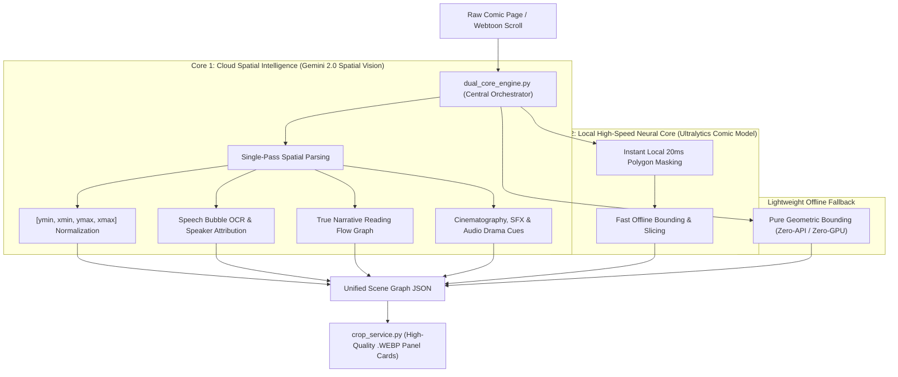

# Dual-Core Spatial Vision Architecture & AI Comic Studio Master Blueprint

> **Status**: Planned / Future Roadmap Architecture  
> **Target Subsystem**: Sonikoma Comic Vision, Auto-Crop, OCR & Multi-Modal Studio Engine  
> **Author**: Antigravity & Sonikoma Engineering  

---

## 1. Executive Summary

This document serves as the master architectural specification and implementation guide for transitioning Sonikoma from heuristic computer vision to the **Dual-Core Spatial Vision Architecture** (Gemini 2.0 Spatial Vision + Unified Local Neural Segmentation).



---

## 2. ⚠️ EXHAUSTIVE AI GUARDRAILS & DEVELOPMENT RULES (WHAT NOT TO DO)

Any AI assistant or developer extending, refactoring, or executing this codebase **MUST STRICTLY OBEY** all 12 core rules:

---

### ❌ Rule 1: DO NOT HARDCODE ABSOLUTE PIXEL VALUES
* **NEVER** use static pixel numbers like `w > 210`, `min_height = 50`, `padding = 40`, `reach = 180`, or fixed Otsu constants (`220`, `240`).
* **ALWAYS** calculate dimensions relative to the image resolution ($W \times H$) and local statistical metrics:
  $$\text{min\_dim\_w} = \max(8, \text{int}(W \times 0.02))$$
  $$\text{min\_dim\_h} = \max(8, \text{int}(H \times 0.008))$$
  $$\text{dyn\_white\_thresh} = \text{clip}\left(\text{Otsu} \times 1.12, 150.0, 240.0\right)$$
  $$\text{Canny}_{\text{low}} = \max(10, \text{int}(0.66 \times \text{median}))$$
  $$\text{Canny}_{\text{high}} = \min(250, \text{int}(1.33 \times \text{median}))$$

---

### ❌ Rule 2: DO NOT NAIVELY CHAIN-MERGE PANELS WITH $gap \le 0$
* **NEVER** merge two consecutive vertically stacked panels just because their bounding boxes touch ($gap_y \le 0$). This causes 10+ separate panels to chain-merge into a giant 6,000px multi-panel block.
* **ONLY** deduplicate candidate boxes if they share a **true 2D area overlap**:
  $$\frac{\text{Area}(\text{Box}_A \cap \text{Box}_B)}{\min(\text{Area}_A, \text{Area}_B)} \ge 0.75$$

---

### ❌ Rule 3: DO NOT OMIT TOP-OF-IMAGE GUTTERS ($y=0$ MARGINS)
* **NEVER** use adjacent-content filters that check `not is_gutter[y - 1]` without guarding for $y=0$.
* For the initial top gutter at $y=0..300$, the cut point at the gutter center **must always be generated**. If dropped, top panels ($y=14$px, $y=150$px) get skipped.

---

### ❌ Rule 4: DO NOT TREAT MULTI-COLUMN 2D MANGA TIERS AS SINGLE BLOCKS
* **NEVER** assume a horizontal tier row contains only 1 panel.
* **ALWAYS** run column decomposition within each tier to extract side-by-side vertical panels (Panel A Left, Panel B Center, Panel C Right).

---

### ❌ Rule 5: DO NOT DISCARD POLYGON VERTICES FOR SLANTED ACTION PANELS
* In action and fight scenes, comic panels are cut diagonally (15° to 45°).
* **NEVER** drop the `polygon` array `[[x1, y1], [x2, y2], [x3, y3], [x4, y4]]`. Standard bounding boxes encapsulate bounds, but the polygon prevents character weapons, fists, or energy blasts from getting clipped.

---

### ❌ Rule 6: DO NOT ALLOW SPEECH BUBBLE BINDING TO CROSS NEIGHBORING PANELS
* When expanding a panel's boundary to enclose a dialogue bubble protruding into a gutter, **NEVER** expand beyond a safe maximum:
  $$\text{max\_expansion\_y} = \max(10, \text{int}(H_{\text{panel}} \times 0.15))$$
  $$\text{max\_expansion\_x} = \max(10, \text{int}(W_{\text{panel}} \times 0.10))$$
* Unbounded expansion causes the panel to cross the gutter and swallow the neighboring frame.

---

### ❌ Rule 7: DO NOT CLASSIFY GENERIC COCO OBJECTS AS SPEECH BUBBLES
* **NEVER** allow generic object detectors (like standard `yolov8n-seg.pt`) to label human faces, blue shirts, or background circles as speech bubbles.
* Every candidate speech bubble **MUST** be validated for:
  - High interior whiteness ratio ($\ge 50\%$).
  - Proportional width and height ($w \le 0.40 \times W$, $h \le 0.25 \times H$).
  - Presence of internal text strokes.

---

### ❌ Rule 8: DO NOT ASSUME GUTTERS ARE ALWAYS PURE WHITE (`#FFFFFF`)
* Gutters can be dark night sky (`#1a1e28`), textured stone, or colored gradients.
* **ALWAYS** detect median background color per tier/region and evaluate column standard deviation ($\sigma \le 6.0$) and stroke density rather than fixed RGB values.

---

### ❌ Rule 9: DO NOT CRASH ON ULTRA-LONG WEAPON/STRIP MEMORY (60,000+ PX)
* **NEVER** allocate un-tiled 3D color arrays without dimension safety.
* When unpacking dimensions from OpenCV/Pillow slices, always use:
  ```python
  h, w = img_array.shape[:2]
  ```
* For strips $> 15,000$px, process in sliding-window tiles ($\text{tile\_h} = 1.5 \times W$, stride = $0.75 \times \text{tile\_h}$) and offset bounding coordinates.

---

### ❌ Rule 10: DO NOT DELETE INSET / PICTURE-IN-PICTURE PANELS
* Smaller panels floating inside a larger panel are intentional narrative insets.
* **NEVER** discard them as "duplicate sub-boxes".
* **ALWAYS** tag them as `depth = 1`, `label = "panel_inset"`, and link `parent_panel_id`.

---

### ❌ Rule 11: DO NOT BREAK EXISTING REST API CONTRACTS
* **NEVER** rename, remove, or alter the response schemas of existing endpoints:
  - `/api/v1/images/crop/detect-type`
  - `/api/v1/images/crop/small-panels`
  - `/api/v1/images/crop/long-panels`
  - `/api/v1/images/crop/single-panel`
  - `/api/v1/images/crop/auto`
* All frontend store actions and background jobs rely on these exact paths.

---

### ❌ Rule 12: DO NOT DRAW FULL-WIDTH HORIZONTAL OVERLAY LINES
* When rendering visual debug overlays (`debug_annotated_strip.png`), **NEVER** use `draw.line([(0, y1), (W, y1)])`.
* Panels must only be outlined by their discrete bounding rectangles or polygon perimeters.

---

## 3. Detailed Architecture Specifications

### A. Dual-Core Engine (`backend/app/services/image/vision/dual_core_engine.py`)
```python
class DualCoreVisionEngine:
    """
    Unified Orchestrator:
    - Automatically selects Cloud Spatial Core (Gemini 2.0 Flash) when online.
    - Gracefully falls back to Local Neural Core or Proportional Geometric Fallback when offline.
    - Handles proportional tiling for ultra-long webtoons (up to 100,000+ px).
    """
    async def process_comic_image(
        self,
        image_bytes: bytes,
        layout_type: str = "auto",
        engine_mode: str = "auto",
        bleed_padding_px: int = 5,
        reading_order: str = "rtl_manga"
    ) -> ComicSceneGraph:
        ...
```

### B. Cloud Spatial Intelligence (`backend/app/services/image/vision/spatial_vision_service.py`)
* Leverages Google's `google-genai` SDK and Gemini 2.0 Flash with spatial grounding tokens.
* Extracts structured JSON in 1 single forward pass:
  ```json
  {
    "panels": [
      {
        "box_2d": [ymin, xmin, ymax, xmax],
        "polygon": [[x1, y1], [x2, y2], [x3, y3], [x4, y4]],
        "reading_order": 1,
        "label": "panel_standard | panel_diagonal | panel_inset | panel_splash",
        "cinematography": "extreme_close_up | close_up | medium_shot | wide_shot | establishing_shot",
        "motion_cue": "pan_down | pan_up | zoom_in | zoom_out | fast_action",
        "pacing_sec": 2.5,
        "characters": [
          {
            "character_id": "char_1",
            "box_2d": [ymin, xmin, ymax, xmax],
            "pose": "face_closeup | upper_body | full_body | dynamic_action",
            "face_box": [ymin, xmin, ymax, xmax],
            "emotion": "angry | shouting | neutral | crying | excited | whispering"
          }
        ],
        "speech_bubbles": [
          {
            "bubble_id": "bubble_1",
            "box_2d": [ymin, xmin, ymax, xmax],
            "bubble_type": "speech | thought | caption | sound_effect",
            "text": "Extracted dialogue string",
            "speaker_id": "char_1",
            "tts_voice_cue": "intense_shout | calm_narration | whispering"
          }
        ]
      }
    ]
  }
  ```

---

## 4. Fight & Action Scene Handling

For high-intensity combat scenes (shonen manga, manhwa battles, superhero brawls):

1. **Diagonal Slash Cuts**:
   - Extracted as multi-vertex polygons (`approxPolyDP`) rather than rectangular boxes, preventing character weapons, kicks, or energy blasts from getting clipped.
2. **Speed Lines & Energy Auras**:
   - Recognized as internal visual effects rather than panel boundaries.
3. **Sound Effects (`BOOM`, `SLASH`, `CLANG`)**:
   - Tagged as `text_type: "sound_effect"` with Foley audio cues for automated video/audio drama generation.

---

## 5. Frontend Store & Settings Integration

In `frontend/src/shared/hooks/useProjectStore.ts`:
```typescript
export interface AutoCropSettings {
  visionEngine?: "auto" | "cloud_spatial" | "local_neural";
  bleedPaddingPx?: number;
  readingOrder?: "rtl_manga" | "ltr_webtoon";
  autoBindSpeakers?: boolean;
  inPaintBubbles?: boolean;
  cropMinHeightPx?: number;
}
```

In `frontend/src/shared/ui/modal/ProjectConfirmModal.tsx`:
* Clean, modern UI controls replacing legacy Canny sliders:
  - **Vision Engine Selector**: `Cloud Spatial Intelligence (Gemini 2.0)` / `Local High-Speed Neural`
  - **Bleed Mode**: `Tight Snap`, `Standard Bleed (+5px)`, `Cinematic Margin`
  - **Reading Flow**: `Manga (Right-to-Left)` vs `Webtoon (Left-to-Right)`

---

## 6. Testbench & Verification Suite

When implementing, verify all edge cases using the testbench:

```powershell
# 1. Regenerate synthetic hard benchmark images
& c:/Users/dheen/project/Sonikoma/.venv/Scripts/python.exe backend/scripts/generate_hard_test_image.py

# 2. Test 2D Manga Grid Challenge (Slanted divider, 3-column tier, dark flashback)
& c:/Users/dheen/project/Sonikoma/.venv/Scripts/python.exe backend/scripts/test_crop_pipeline.py --file data/test_assets/hard_test_manga_grid_2d.png --out-dir output_test_hard_manga

# 3. Test Webtoon Scroll Challenge (Tight 10px gutters, diagonal cuts, dark blue gradient)
& c:/Users/dheen/project/Sonikoma/.venv/Scripts/python.exe backend/scripts/test_crop_pipeline.py --file data/test_assets/hard_test_webtoon_scroll.png --out-dir output_test_hard_webtoon

# 4. Generate 12-Stage Visual Diagnostics on 60,000px Ultra-Long Strip
& c:/Users/dheen/project/Sonikoma/.venv/Scripts/python.exe backend/scripts/debug_visualizer.py --file data/debug_output/debug_cli_test_01_original.png --out-dir data/debug_output
```
