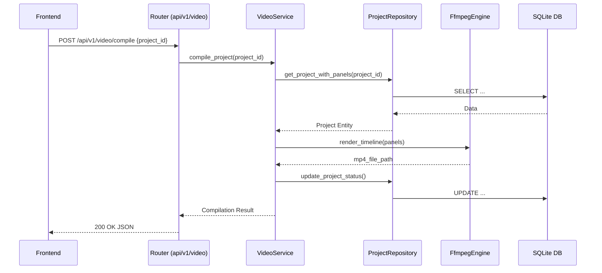
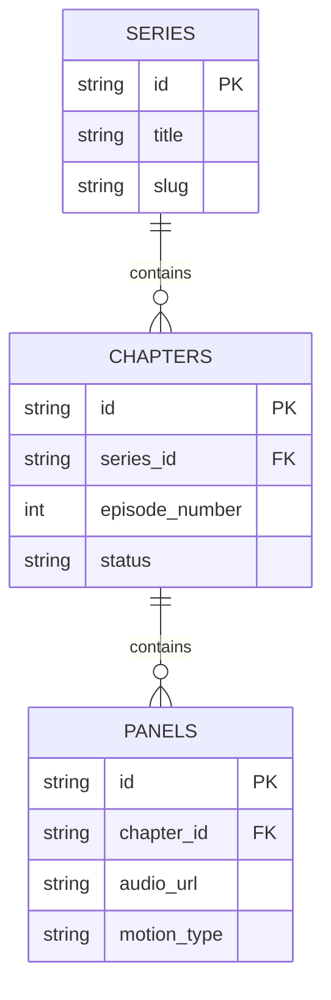

# Sonikoma Backend Architecture

This document describes the current architecture of the Sonikoma Python FastAPI backend, detailing the layer responsibilities, dependency flow, and core patterns.

---

## 1. High-Level Architecture Overview

The backend employs a strict Layered Architecture to separate concerns, improve testability, and decouple the HTTP transport mechanism from the core business logic and data access.

```mermaid
graph TD
    Client[Frontend Client] --> API[API Layer (FastAPI Routers)]

    subgraph Backend [Python FastAPI Backend]
        API --> Core[Core Layer (Config/Middleware)]
        API --> Service[Service Layer (Business Logic)]

        Service --> Repository[Repository Layer (Data Access)]
        Service --> Provider[Provider Layer (External APIs)]
        Service --> Engine[Engine Layer (Heavy Computation)]

        Repository --> DB[(Local SQLite Database)]
        Provider --> ExtAI[External AI/TTS Services (Gemini, EdgeTTS)]
        Engine --> SubProc[Subprocesses (ffmpeg, ImageMagick)]
    end
```

---

## 2. Layer Definitions & Boundaries

### 2.1 API Layer (`backend/app/api/`)
**Responsibility:** Handling HTTP requests, routing, parameter validation, and formatting JSON responses.
**Rules:**
- Must only use FastAPI primitives (`APIRouter`, `Depends`, `HTTPException`).
- Must not contain business logic.
- Must delegate processing to the Service Layer.

### 2.2 Service Layer (`backend/app/services/`)
**Responsibility:** Orchestrating business logic and complex workflows (e.g., video compilation pipeline).
**Rules:**
- Coordinates calls between Repositories, Providers, and Engines.
- Must not execute SQL directly.
- Must not format HTTP responses.
- Raises Domain Exceptions (`SonikomaException`), not `HTTPException`.

### 2.3 Repository Layer (`backend/app/repositories/`)
**Responsibility:** Abstracting data persistence and retrieval.
**Rules:**
- The *only* layer permitted to interact with the database engine.
- Translates domain models to database schemas.

### 2.4 Provider Layer (`backend/app/providers/`)
**Responsibility:** Abstracting interactions with external third-party APIs (e.g., Google Gemini, Text-to-Speech APIs).
**Rules:**
- Exposes generic interfaces to the Service Layer, hiding vendor-specific implementation details.

### 2.5 Engine Layer (`backend/app/engines/`)
**Responsibility:** Encapsulating low-level, resource-intensive computational logic.
**Rules:**
- Manages subprocesses for tools like `ffmpeg`.
- Handles complex mathematical or matrix operations (e.g., OpenCV, Librosa).

### 2.6 Core Layer (`backend/app/core/`)
**Responsibility:** Application-wide configuration, security settings, custom exceptions, and middleware.

---

## 3. Directory Structure

The backend is organized under the `backend/app/` directory:

```text
backend/app/
├── api/             # FastAPI routers and dependency injection
│   └── v1/          # Versioned endpoints (e.g., auth, projects, video)
├── core/            # App configuration, exceptions, settings, middleware
├── database/        # Database setup, connection management, schema definitions
├── domain/          # Core domain models and entities
├── engines/         # Heavy computation wrappers (ffmpeg, whisper, SD)
├── providers/       # External service adapters (AI, Vision, Media)
├── repositories/    # Data access objects (ProjectRepository, UserRepository)
├── services/        # Business logic orchestration (Workflows, Auth, Export)
└── utils/           # Shared helper functions (ID generation, File I/O)
```

---

## 4. Request Flow Example (Video Compilation)



---

## 5. Database Design

Sonikoma utilizes a local SQLite database (`webtoon_local.db`) for zero-configuration persistence. The core relational hierarchy is:


