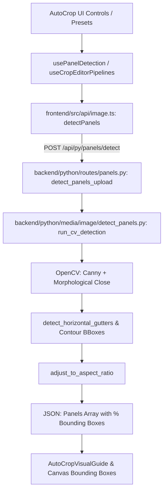

# Sonikoma Auto Crop & Panel Detection Inventory

This inventory documents all **Auto Crop** and **Panel Detection** functionality across the entire Sonikoma stack (Backend APIs, Processing Algorithms, Frontend UI Components, Custom Hooks, and Client Services).

---

## 1. Backend APIs & Endpoints (FastAPI)

| File Path | Function / Route Handler | HTTP Method & Route | Description |
| :--- | :--- | :--- | :--- |
| [`backend/python/routes/panels.py`](file:///c:/Users/dheen/project/Sonikoma/backend/python/routes/panels.py#L71-L132) | `detect_panels_upload(...)` | `POST /api/py/panels/detect` (`multipart/form-data`) | Receives uploaded webtoon/comic image files, executes OpenCV contour panel detection, and returns bounding box arrays & percentage crop metrics. |
| [`backend/python/routes/panels.py`](file:///c:/Users/dheen/project/Sonikoma/backend/python/routes/panels.py#L134-L175) | `detect_panels_base64(...)` | `POST /api/py/panels/detect-b64` (`application/json`) | Accepts base64 encoded image string + detection parameters (`DetectPanelsBase64Request`) and returns panel bounding boxes. |
| [`backend/python/routes/panels.py`](file:///c:/Users/dheen/project/Sonikoma/backend/python/routes/panels.py#L52-L65) | `_detect(image_path, params)` | Internal Helper | Intermediary function mapping REST parameters into `run_cv_detection(...)`. |
| [`backend/python/routes/image_routes.py`](file:///c:/Users/dheen/project/Sonikoma/backend/python/routes/image_routes.py) | `crop_image_endpoint(...)` | `POST /api/py/image/crop` | Performs explicit coordinate or percentage bounding box image cropping. |
| [`backend/python/routes/image_routes.py`](file:///c:/Users/dheen/project/Sonikoma/backend/python/routes/image_routes.py) | `smart_crop_endpoint(...)` | `POST /api/py/image/smart-crop` | Performs focal-point salient auto-cropping for single images. |

---

## 2. Backend Processing Engines & Algorithms (OpenCV / ImageMagick)

| File Path | Function / Method | Category | Description |
| :--- | :--- | :--- | :--- |
| [`backend/python/media/image/detect_panels.py`](file:///c:/Users/dheen/project/Sonikoma/backend/python/media/image/detect_panels.py) | `run_cv_detection(...)` | Core Algorithm | Primary OpenCV detection algorithm using Canny edges, morphological closing, contour detection, area filtering, and gutter splitting. |
| [`backend/python/media/image/detect_panels.py`](file:///c:/Users/dheen/project/Sonikoma/backend/python/media/image/detect_panels.py#L12-L35) | `adjust_to_aspect_ratio(...)` | Geometry Math | Adjusts detected panel bounding boxes to match locked target aspect ratios (1:1, 16:9, 9:16, 4:3). |
| [`backend/python/media/image/detect_panels.py`](file:///c:/Users/dheen/project/Sonikoma/backend/python/media/image/detect_panels.py) | `detect_background_color(...)` | Analysis | Analyzes border pixels to automatically detect background color mode (`white` vs `black`). |
| [`backend/python/media/image/detect_panels.py`](file:///c:/Users/dheen/project/Sonikoma/backend/python/media/image/detect_panels.py) | `detect_horizontal_gutters(...)` | Webtoon Slicing | Scans row intensities to find horizontal gutters and split long vertical strips into discrete panels. |
| [`backend/python/media/image/detect_panels.py`](file:///c:/Users/dheen/project/Sonikoma/backend/python/media/image/detect_panels.py) | `merge_bounding_boxes(...)` | Bounding Box Refinement | Merges overlapping or near-adjacent panel bounding boxes based on threshold distance. |
| [`backend/python/media/image/imagemagick_engine.py`](file:///c:/Users/dheen/project/Sonikoma/backend/python/media/image/imagemagick_engine.py) | `crop_image(...)` | ImageMagick CLI | Executes hardware-accelerated precision cropping via `magick convert -crop`. |
| [`backend/python/media/image/imagemagick_engine.py`](file:///c:/Users/dheen/project/Sonikoma/backend/python/media/image/imagemagick_engine.py) | `auto_trim_borders(...)` | Auto Trim | Shaves off uniform solid background borders around panels using ImageMagick `-trim`. |

---

## 3. Frontend API Clients & Services

| File Path | Function Name | Target API Endpoint | Description |
| :--- | :--- | :--- | :--- |
| [`frontend/src/api/image.ts`](file:///c:/Users/dheen/project/Sonikoma/frontend/src/api/image.ts) | `detectPanels(fileOrBase64, params)` | `POST /api/py/panels/detect` / `detect-b64` | Client-side wrapper for executing backend panel detection. |
| [`frontend/src/api/image.ts`](file:///c:/Users/dheen/project/Sonikoma/frontend/src/api/image.ts) | `cropImage(params)` | `POST /api/py/image/crop` | Client-side API call to request server-side image cropping. |
| [`frontend/src/api/ai.ts`](file:///c:/Users/dheen/project/Sonikoma/frontend/src/api/ai.ts) | `smartCropImage(params)` | `POST /api/py/image/smart-crop` | Client-side API call for AI salient focal-point cropping. |

---

## 4. Frontend Custom React Hooks

| File Path | Hook Name | Purpose |
| :--- | :--- | :--- |
| [`frontend/src/hooks/usePanelDetection.ts`](file:///c:/Users/dheen/project/Sonikoma/frontend/src/hooks/usePanelDetection.ts) | `usePanelDetection()` | Handles detection state, triggers API requests, stores panel bounding boxes, and manages sensitivity parameters. |
| [`frontend/src/hooks/useAutoCropPresets.ts`](file:///c:/Users/dheen/project/Sonikoma/frontend/src/hooks/useAutoCropPresets.ts) | `useAutoCropPresets()` | Manages preset configurations for comic genres (Webtoon Vertical, Manga Grid, Canny High, etc.). |
| [`frontend/src/hooks/useCropEditorPipelines.ts`](file:///c:/Users/dheen/project/Sonikoma/frontend/src/hooks/useCropEditorPipelines.ts) | `useCropEditorPipelines()` | Orchestrates multi-step crop execution pipelines (Detection -> Margins -> Ratio Lock -> Export). |
| [`frontend/src/hooks/useCropEditorHistory.ts`](file:///c:/Users/dheen/project/Sonikoma/frontend/src/hooks/useCropEditorHistory.ts) | `useCropEditorHistory()` | State stack providing Undo/Redo operations for crop boundaries. |
| [`frontend/src/hooks/useCropEditorDrag.ts`](file:///c:/Users/dheen/project/Sonikoma/frontend/src/hooks/useCropEditorDrag.ts) | `useCropEditorDrag()` | Handles interactive canvas mouse drag events to resize/re-position bounding boxes. |

---

## 5. Frontend UI Components & Controls

### Batch Processing Modal
| File Path | Component Name | Description |
| :--- | :--- | :--- |
| [`frontend/src/components/Feature/processing/AutoCropModal.tsx`](file:///c:/Users/dheen/project/Sonikoma/frontend/src/components/Feature/processing/AutoCropModal.tsx) | `AutoCropModal` | Modal dialog for bulk running auto crop & panel detection across multiple selected images. |

### Image Editor AutoCrop Tool Suite
Location: `frontend/src/components/Feature/editor/Tools/ImageEditor/AutoCrop/`

| File Path | Component Name | Description |
| :--- | :--- | :--- |
| [`AutoCropSettingsPanel.tsx`](file:///c:/Users/dheen/project/Sonikoma/frontend/src/components/Feature/editor/Tools/ImageEditor/AutoCrop/AutoCropSettingsPanel.tsx) | `AutoCropSettingsPanel` | Main tabbed container for AutoCrop controls. |
| [`AutoCropEngineSelector.tsx`](file:///c:/Users/dheen/project/Sonikoma/frontend/src/components/Feature/editor/Tools/ImageEditor/AutoCrop/AutoCropEngineSelector.tsx) | `AutoCropEngineSelector` | Engine selection matrix (OpenCV Contour, Canny Edge, AI Salient, Auto Slicer). |
| [`AutoCropGeneralTab.tsx`](file:///c:/Users/dheen/project/Sonikoma/frontend/src/components/Feature/editor/Tools/ImageEditor/AutoCrop/AutoCropGeneralTab.tsx) | `AutoCropGeneralTab` | General controls (sensitivity, background mode, min dimensions). |
| [`AutoCropCannyControls.tsx`](file:///c:/Users/dheen/project/Sonikoma/frontend/src/components/Feature/editor/Tools/ImageEditor/AutoCrop/AutoCropCannyControls.tsx) | `AutoCropCannyControls` | Sliders for `canny_low`, `canny_high`, and `close_kernel_size`. |
| [`AutoCropLayoutTab.tsx`](file:///c:/Users/dheen/project/Sonikoma/frontend/src/components/Feature/editor/Tools/ImageEditor/AutoCrop/AutoCropLayoutTab.tsx) | `AutoCropLayoutTab` | Grid layouts, aspect ratio locking, and page layout configuration. |
| [`AutoCropAdvancedTab.tsx`](file:///c:/Users/dheen/project/Sonikoma/frontend/src/components/Feature/editor/Tools/ImageEditor/AutoCrop/AutoCropAdvancedTab.tsx) | `AutoCropAdvancedTab` | Advanced thresholds (merge distance, auto-split gutters, bounding box tolerances). |
| [`AutoCropGutterModeToggle.tsx`](file:///c:/Users/dheen/project/Sonikoma/frontend/src/components/Feature/editor/Tools/ImageEditor/AutoCrop/AutoCropGutterModeToggle.tsx) | `AutoCropGutterModeToggle` | Toggle switch & controls for Webtoon gutter split detection. |
| [`AutoCropMarginPadding.tsx`](file:///c:/Users/dheen/project/Sonikoma/frontend/src/components/Feature/editor/Tools/ImageEditor/AutoCrop/AutoCropMarginPadding.tsx) | `AutoCropMarginPadding` | Controls for adjusting inner padding & outer margin offsets. |
| [`AutoCropPresetGrid.tsx`](file:///c:/Users/dheen/project/Sonikoma/frontend/src/components/Feature/editor/Tools/ImageEditor/AutoCrop/AutoCropPresetGrid.tsx) | `AutoCropPresetGrid` | Visual grid of quick presets (Webtoon, Manga, 16:9, etc.). |
| [`AutoCropEngineComparison.tsx`](file:///c:/Users/dheen/project/Sonikoma/frontend/src/components/Feature/editor/Tools/ImageEditor/AutoCrop/AutoCropEngineComparison.tsx) | `AutoCropEngineComparison` | Side-by-side visual detection result comparison tool. |
| [`AutoCropVisualGuide.tsx`](file:///c:/Users/dheen/project/Sonikoma/frontend/src/components/Feature/editor/Tools/ImageEditor/AutoCrop/AutoCropVisualGuide.tsx) | `AutoCropVisualGuide` | Interactive overlay visualizer showing detected panel boxes & gutters. |
| [`AutoCropComplexityAnalysis.tsx`](file:///c:/Users/dheen/project/Sonikoma/frontend/src/components/Feature/editor/Tools/ImageEditor/AutoCrop/AutoCropComplexityAnalysis.tsx) | `AutoCropComplexityAnalysis` | Page analysis indicator recommending parameter adjustments based on visual density. |
| [`AutoCropCustomProfileManager.tsx`](file:///c:/Users/dheen/project/Sonikoma/frontend/src/components/Feature/editor/Tools/ImageEditor/AutoCrop/AutoCropCustomProfileManager.tsx) | `AutoCropCustomProfileManager` | UI to create, save, export, and import custom detection profiles. |
| [`AutoCropJsonDebugger.tsx`](file:///c:/Users/dheen/project/Sonikoma/frontend/src/components/Feature/editor/Tools/ImageEditor/AutoCrop/AutoCropJsonDebugger.tsx) | `AutoCropJsonDebugger` | Debug payload viewer for current auto-crop parameter objects. |
| [`AutoCropRatioLockSelector.tsx`](file:///c:/Users/dheen/project/Sonikoma/frontend/src/components/Feature/editor/Tools/ImageEditor/AutoCrop/AutoCropRatioLockSelector.tsx) | `AutoCropRatioLockSelector` | Dropdown for locking bounding boxes to fixed aspect ratios. |
| [`AutoCropTabContent.tsx`](file:///c:/Users/dheen/project/Sonikoma/frontend/src/components/Feature/editor/Tools/ImageEditor/AutoCrop/AutoCropTabContent.tsx) | `AutoCropTabContent` | Tab content switcher/router component. |
| [`AutoSlicer.tsx`](file:///c:/Users/dheen/project/Sonikoma/frontend/src/components/Feature/editor/Tools/ImageEditor/AutoCrop/AutoSlicer.tsx) | `AutoSlicer` | Specialized slicer component for horizontal gutter cutting. |
| [`AutoSlicerSettings.tsx`](file:///c:/Users/dheen/project/Sonikoma/frontend/src/components/Feature/editor/Tools/ImageEditor/AutoCrop/AutoSlicerSettings.tsx) | `AutoSlicerSettings` | Parameter controls for AutoSlicer gutter gap thresholds. |
| [`AutoSlicerCanny.tsx`](file:///c:/Users/dheen/project/Sonikoma/frontend/src/components/Feature/editor/Tools/ImageEditor/AutoCrop/AutoSlicerCanny.tsx) | `AutoSlicerCanny` | Edge-detection powered slicer for dark background webtoons. |
| [`autoCropConfig.ts`](file:///c:/Users/dheen/project/Sonikoma/frontend/src/components/Feature/editor/Tools/ImageEditor/AutoCrop/autoCropConfig.ts) | Constants & Config | Preset definitions, engine metadata, and default detection parameters. |

---

## Data Flow Summary

